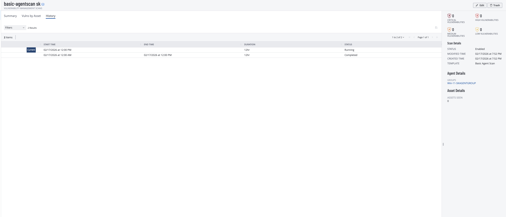

# Tenable Linux Lab: Agent Scan Trigger Validation

## Objective

Validate that a Linux Nessus agent scan triggers correctly from Tenable and confirm agent-based workflow behavior using the standard lab process.

## Environment

- Linux VM in cloud test environment
- Tenable Vulnerability Management (Nessus Agents)
- Basic Agent Scan with trigger-based execution
- Agent group-based targeting

## Evidence

### Agent scan successfully triggered

## What changed & why

This lab focuses on execution validation rather than full scan comparison. The key outcome is confirming that agent trigger conditions were met and scan execution started from the configured workflow. This verifies that the agent channel and trigger logic were functioning as expected.

## Notable findings (examples)

- Triggered scan execution was observed in Tenable using agent-based monitoring.
- The workflow aligns with standard lab notes for agent setup and trigger operation.
- This evidence supports readiness for follow-on result analysis runs.

## Redaction note

Current screenshots and notes may include sensitive identifiers (for example IP addresses, hostnames, usernames, tenant details, scanner names, or agent identifiers). Redact or blur sensitive fields before public publishing.

## Source brief

- Lab notes: `source/lab-brief.pdf`
