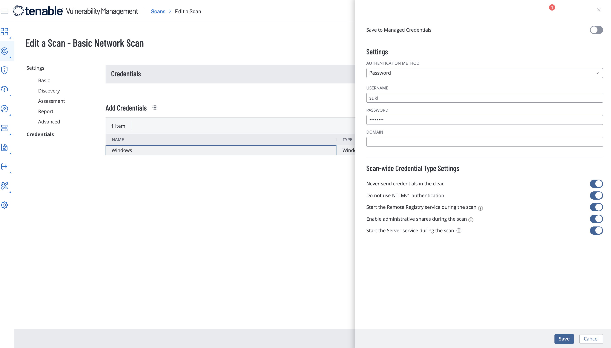
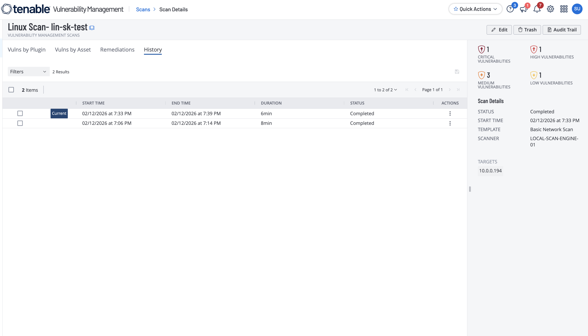

# Tenable Linux Lab: Authenticated vs Unauthenticated Scan

## Objective

Compare unauthenticated and SSH-authenticated Tenable scanning on a Linux target to demonstrate the increase in confirmed vulnerability coverage with credentials.

## Evidence

### Linux credentials configuration

### Scan history and side-by-side results

## Results

| Scan Type | Critical | High | Medium | Low | Info | Total |
|---|---:|---:|---:|---:|---:|---:|
| Unauthenticated Linux | 0 | 0 | 0 | 1 | 22 | 23 |
| Authenticated Linux | 1 | 1 | 3 | 1 | 58 | 64 |

## What changed & why

When SSH credentials were provided, Tenable could perform local checks, package/version inspection, and patch enumeration. This allows stronger confirmation of vulnerabilities and uncovers issues that network-only probing cannot reliably validate.

## Notable findings (examples)

The authenticated Linux report includes advisory-driven findings (for example, Ubuntu Security Notice/USN-related package vulnerabilities) and patch-level gaps that were not visible in the unauthenticated scan. These authenticated checks are generally more accurate because they use host package metadata and installed version data.

## Redaction note

Artifacts may contain sensitive internal identifiers (such as private IP addressing, hostnames, usernames, or scanner metadata). Redact or blur these values before publishing to a public repository.
