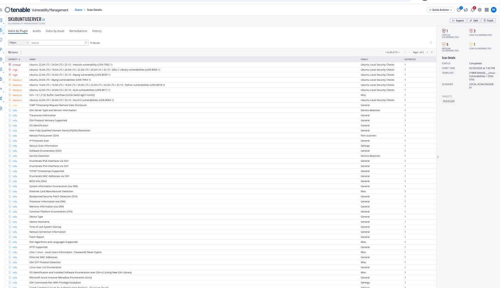
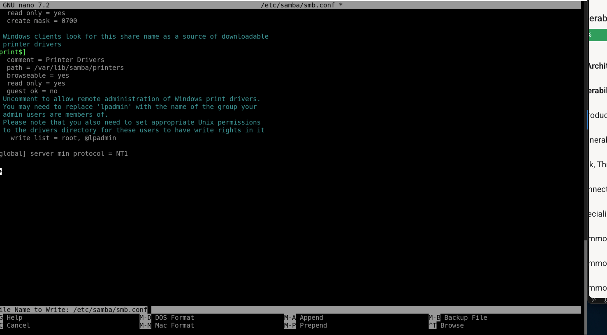
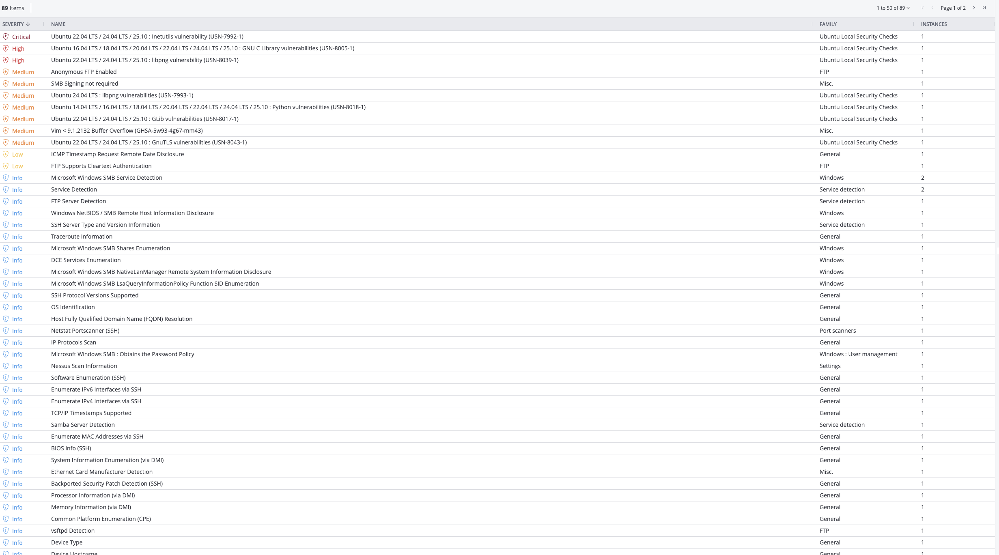
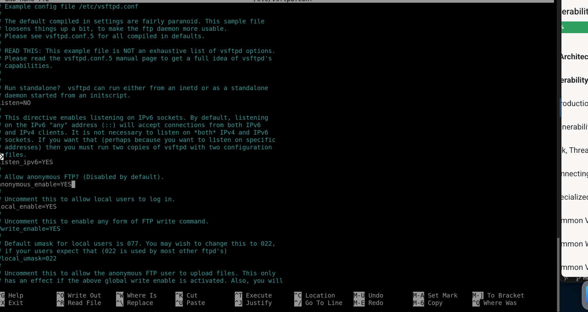
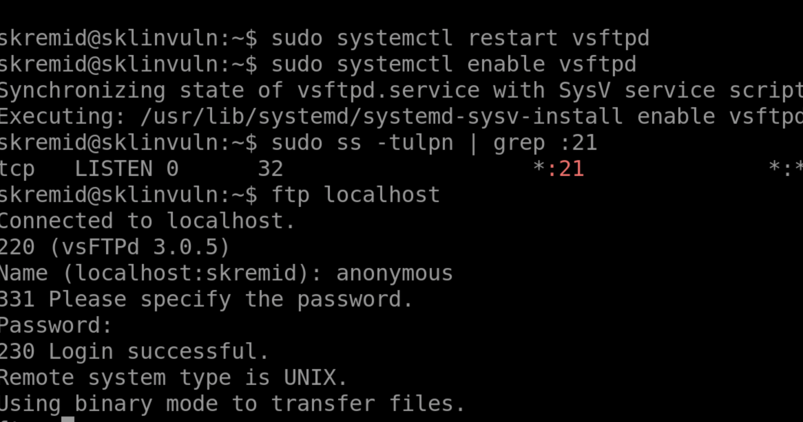
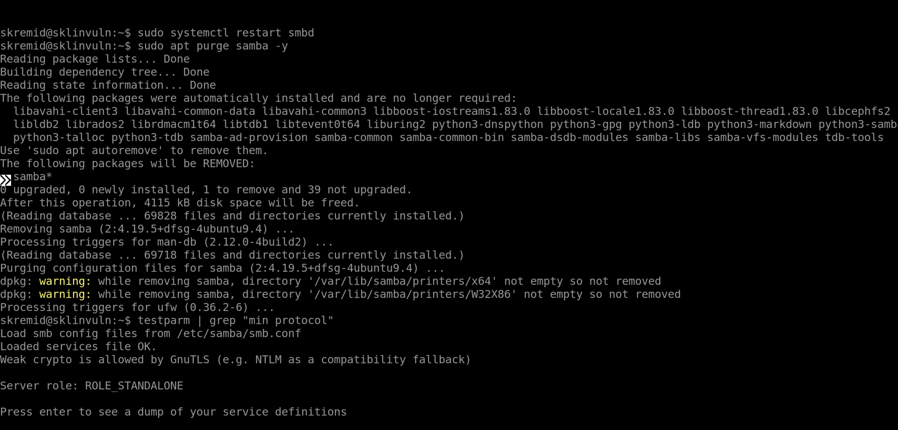
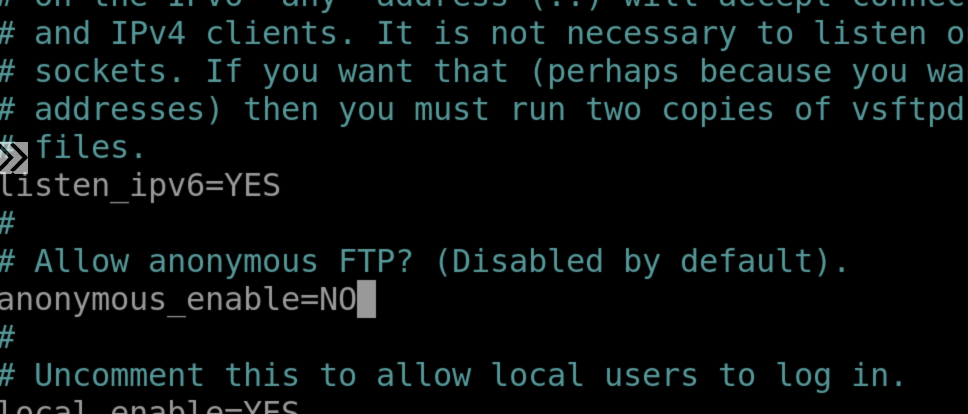
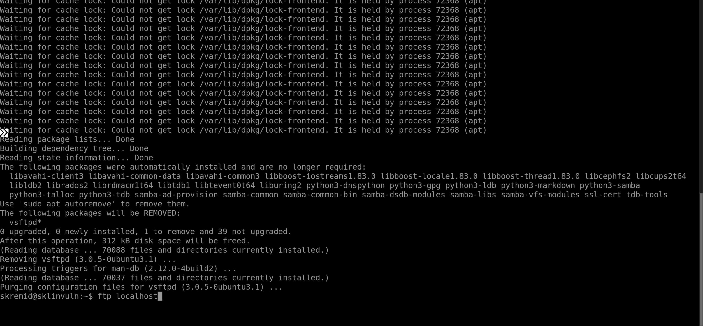
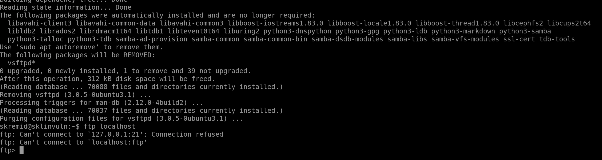
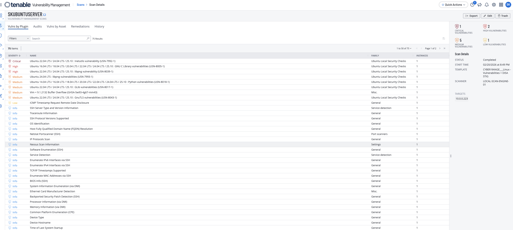

# Tenable Linux Lab: Manual Vulnerability Creation and Remediation

## Objective

Run authenticated Linux scanning, intentionally introduce insecure configurations, and verify remediation through follow-up scans.

## Environment

- Ubuntu 24.04 LTS VM in Azure
- Tenable Vulnerability Management (authenticated scanning)
- Linux DISA/STIG user-defined scan template
- SSH credentialed scanning with privilege elevation

## Evidence

### Baseline authenticated scan before manual vulnerability changes

### SMB configuration edit to introduce vulnerable protocol settings

### Service/port verification after service changes

### Anonymous FTP enabled in configuration

### Proof of anonymous upload risk

### Scan results after vulnerability creation

### SMB remediation actions

### Anonymous FTP disabled

### Configuration cleanup verification

### FTP package removal and verification

### Closed-service verification (FTP no longer accessible)

### Final rescan after remediation

## What changed & why

This lab progressed from a clean authenticated Linux baseline to intentional vulnerability introduction (SMB protocol weakening and anonymous FTP exposure), followed by hardening and package removal. Rescan evidence confirms that remediation steps reduced attack surface and removed risky services.

## Notable findings (examples)

- Preliminary scan behavior issues were caused by target addressing mistakes; using the correct internal/private target in the internal scanner path fixed scan execution consistency.
- Vulnerability visibility increased after deliberate insecure configuration changes.
- Remediation actions included disabling SMB-related weak settings, disabling anonymous FTP, and removing vulnerable/unneeded services/packages.
- Final scans showed reduced findings after cleanup and service closure checks.

## Redaction note

Current screenshots and artifacts may include sensitive identifiers (for example IP addresses, hostnames, usernames, tenant details, scanner names, or credential-related fields). Redact or blur sensitive fields before public publishing.

## Source brief

- Lab notes: `source/lab-brief.docx`
