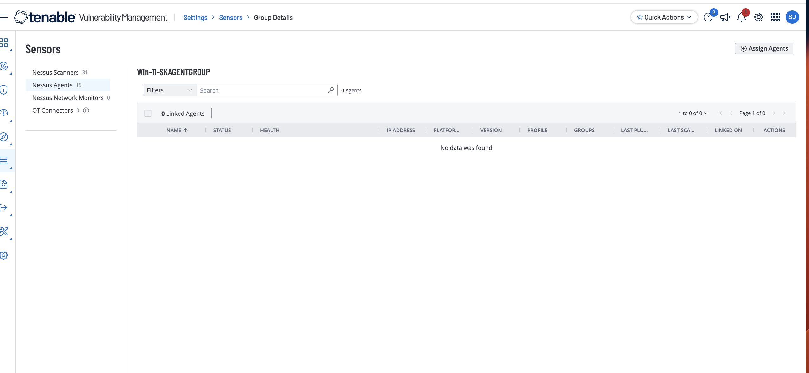
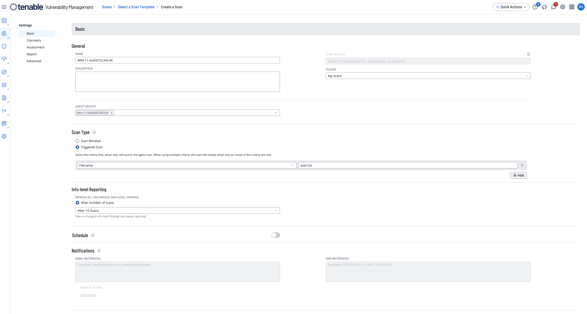
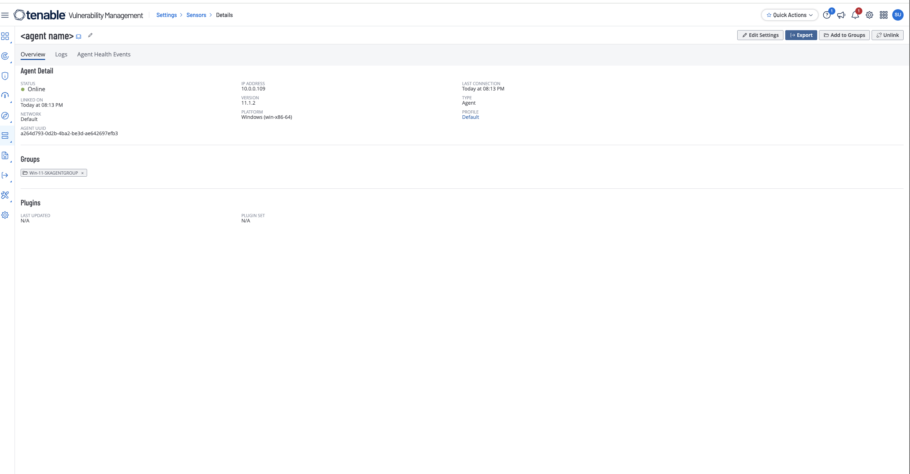
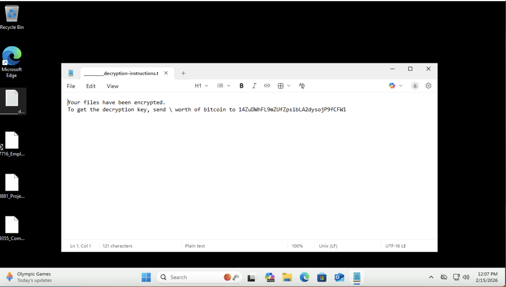

# Tenable Windows Lab: Agent-Based Monitoring and Triggered Scans

## Objective

Deploy a Nessus agent on a Windows VM, run a basic agent scan with trigger-based execution, and validate agent-linked vulnerability visibility in Tenable.

## Environment

- Azure-hosted Windows VM
- Tenable Vulnerability Management (Nessus Agents)
- Basic Agent Scan with trigger file execution
- Dedicated Agent Group for scoped testing

## Evidence

### Basic Nessus agent scan creation

### Triggered scan setup

### Agent successfully linked in Tenable

### Ransomware incident evidence from test VM

## What changed & why

Unlike network-based external probing, agent-based scanning runs locally on the host and can continue collecting telemetry even when perimeter filtering reduces external visibility. Trigger-based scans add controlled execution for repeatable testing and faster validation cycles.

## Notable findings (examples)

- Agent onboarding required correct group assignment and accurate provisioning command execution in elevated PowerShell.
- Trigger-file naming/placement directly affected whether scans launched successfully.
- Agent linkage and delayed result population in Tenable required waiting for ingestion before evaluating findings.
- A real ransomware event occurred during setup on a test VM, reinforcing the risk of weak credentials and exposed test infrastructure.

## Incident recovery note

During scanner setup, a ransomware attack affected the lab VM. Recovery was completed by deleting the compromised VM and restoring from a known-good Azure backup image. This is preserved as part of the lab evidence and highlights the need for strong credentials, reduced exposure windows, and fast rollback capability.

## Redaction note

Current screenshots and artifacts may include sensitive identifiers (for example hostnames, internal/public IPs, usernames, tenant details, scanner IDs, or key-like values). Before publishing publicly, crop or blur sensitive fields and redact identifiers.

## Source brief

- Lab notes: `source/lab-brief.docx`
