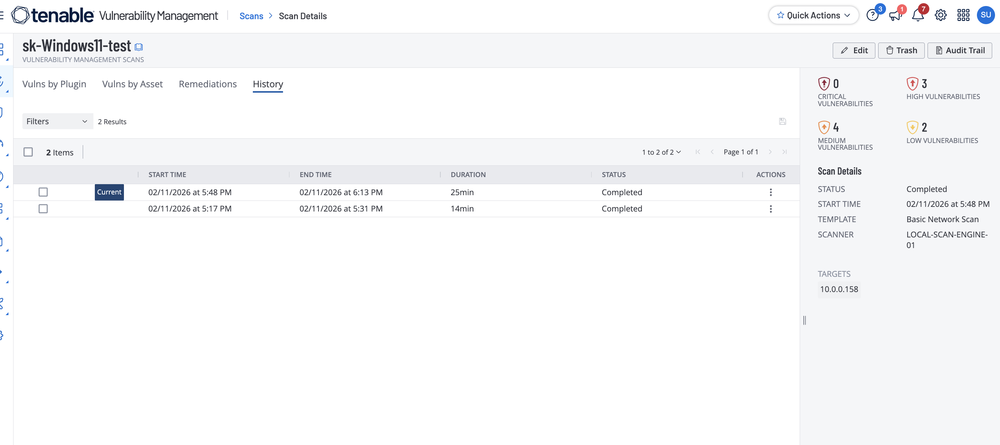

# Tenable Windows Lab: Authenticated vs Unauthenticated Scan

## Objective

Compare unauthenticated and authenticated Tenable scanning on a Windows target to show how credentialed checks improve vulnerability visibility.

## Environment

- Cloud-hosted Windows VM (Azure)
- Remote administration via RDP
- Tenable Basic Network Scan policy
- Two scan modes: unauthenticated and SMB/WMI-authenticated

## Evidence

### Unauthenticated scan setup

### Windows credentials configuration

### Scan history and side-by-side results

## Results

| Scan Type | Critical | High | Medium | Low | Info | Total |
|---|---:|---:|---:|---:|---:|---:|
| Unauthenticated Windows | 0 | 0 | 4 | 1 | 33 | 38 |
| Authenticated Windows | 0 | 3 | 4 | 2 | 134 | 143 |

## What changed & why

Authenticated scanning produced substantially more findings because Tenable could log in and enumerate host-level details (for example, OS/software inventory and patch state) through Windows credentialed checks such as SMB/WMI. Unauthenticated scanning is mostly limited to what can be inferred from network-exposed services.

## Notable findings (examples)

From the authenticated report, higher-severity findings include missing security updates and configuration weaknesses that were not fully observable in the unauthenticated run. The report also includes additional software and patch audit results that increased informational and actionable coverage compared with the unauthenticated baseline.

## Redaction note

Current screenshots and report artifacts may include sensitive identifiers (for example internal IP addresses, hostnames, usernames, or scanner profile details). Before publishing publicly, crop or blur sensitive fields and redact identifiers.
