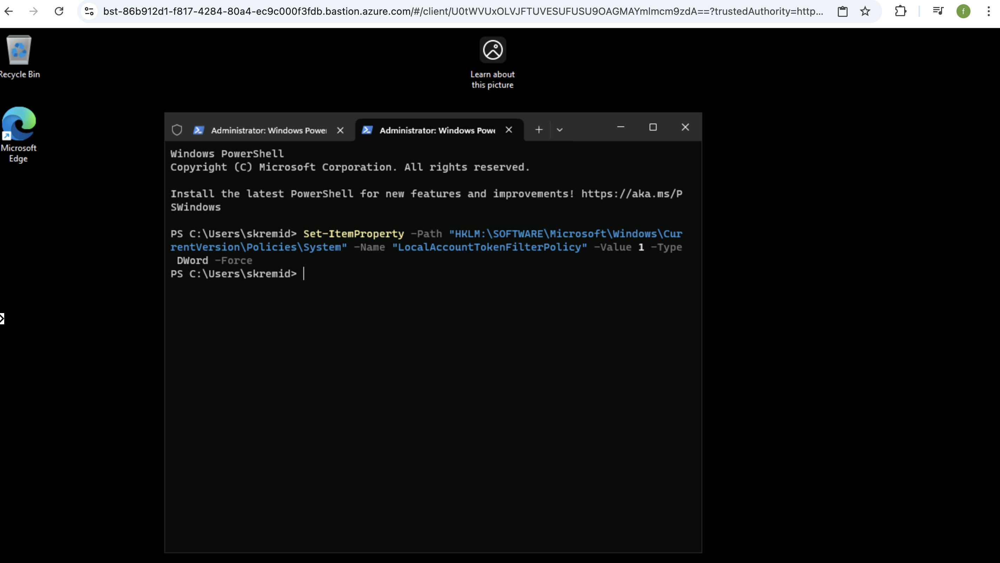
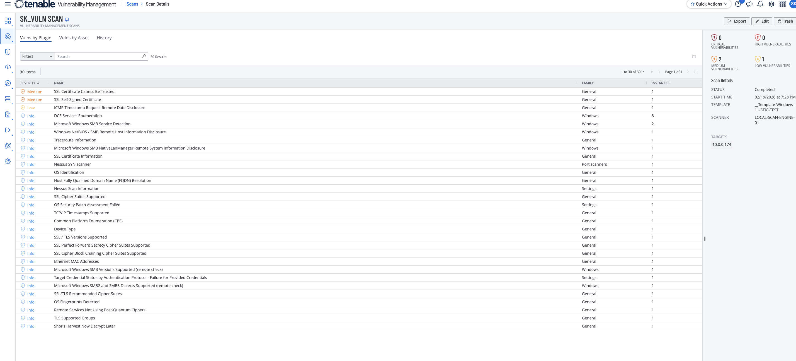
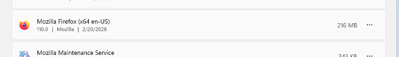
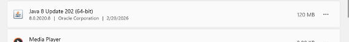

# Tenable Windows Lab: Manual Vulnerability Creation and Remediation

## Objective

Run authenticated Windows scanning, intentionally introduce vulnerable conditions, and validate remediation effectiveness through rescan results.

## Environment

- Azure-hosted Windows 11 VM
- Tenable Vulnerability Management (authenticated scan)
- User-defined Windows 11 DISA/STIG template
- Credentialed scanning with administrative access

## Evidence

### PowerShell remote administration registry fix

### Authenticated scan showing vulnerabilities

### Windows remediation actions

### Uninstalling insecure Mozilla software

### Uninstalling vulnerable Java software

## What changed & why

This lab moved from baseline authenticated scanning to intentional vulnerability creation and manual hardening. Vulnerabilities were introduced (missing updates, SMBv1 exposure, insecure software), then remediated through Windows updates, SMBv1 disablement, and software removal. Rescanning validates whether risk was actually reduced.

## Notable findings (examples)

- Preliminary scans returned instant/short results when target addressing was wrong; using the correct private IP for the network path fixed scan execution behavior.
- Credentialed scan depth improved after applying the LocalAccountTokenFilterPolicy PowerShell change.
- Vulnerability visibility increased after vulnerable software/configuration states were introduced.
- Post-remediation rescans demonstrated reduced exposure after update and uninstall actions.

## Redaction note

Current screenshots and artifacts may include sensitive identifiers (for example IP addresses, hostnames, usernames, tenant details, scanner names, or credential-related fields). Redact or blur sensitive fields before public publishing.

## Source brief

- Lab notes: `source/lab-brief.docx`
