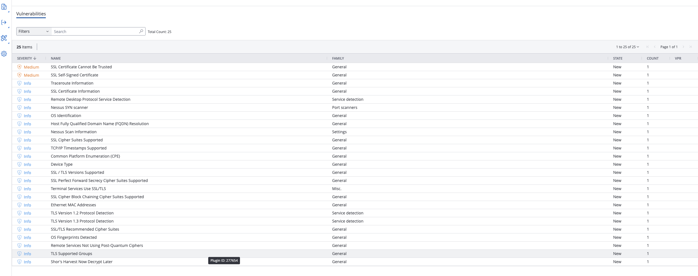
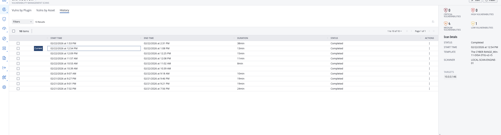
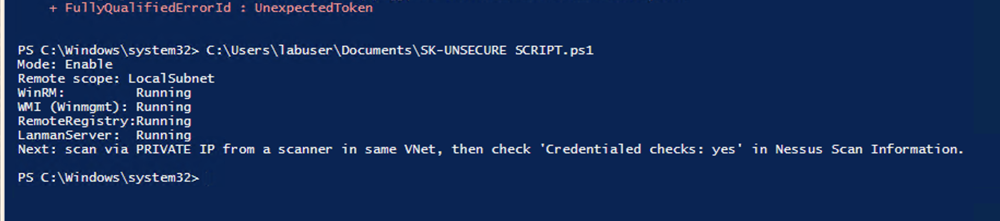
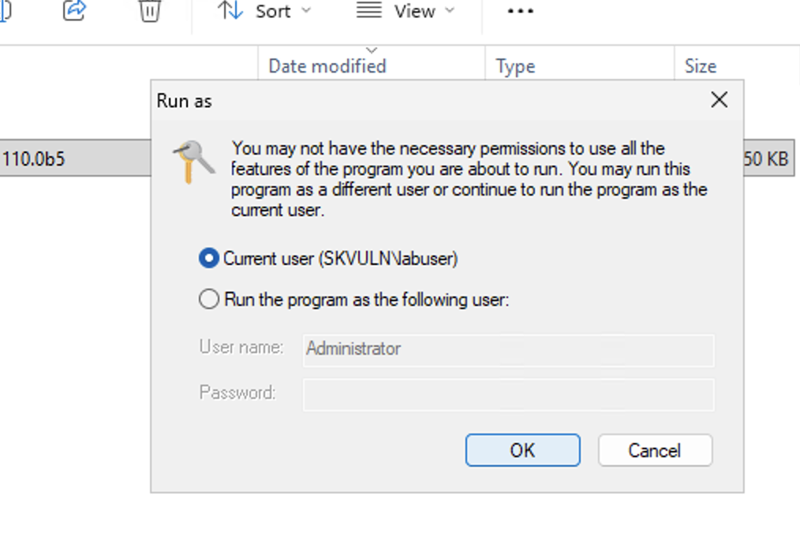
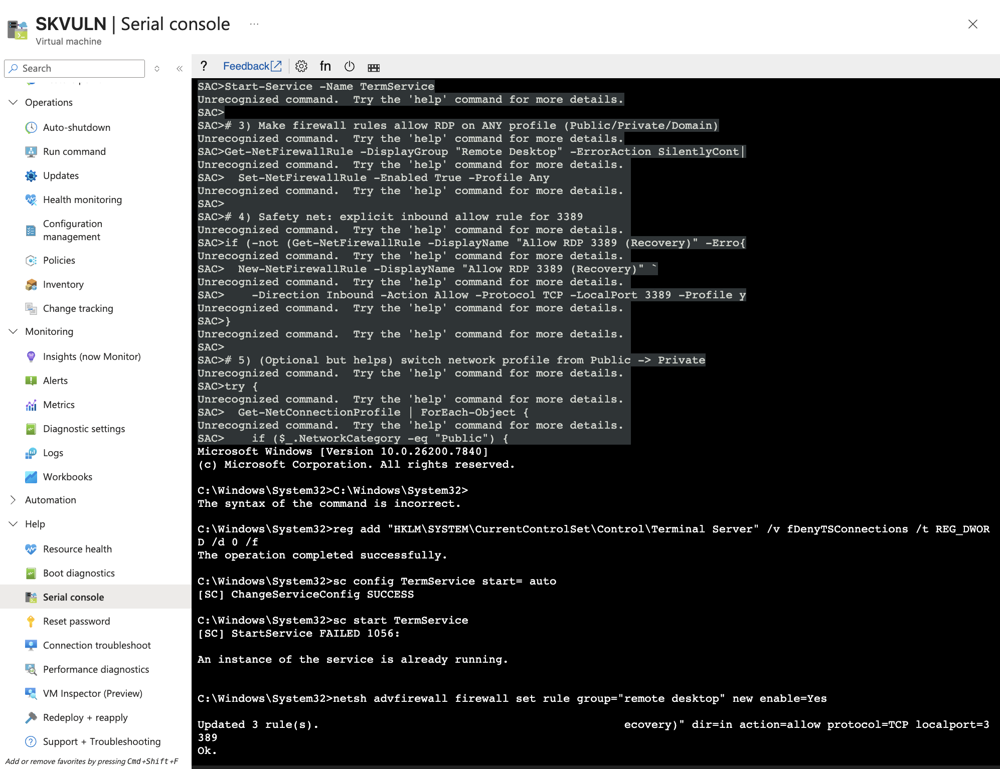
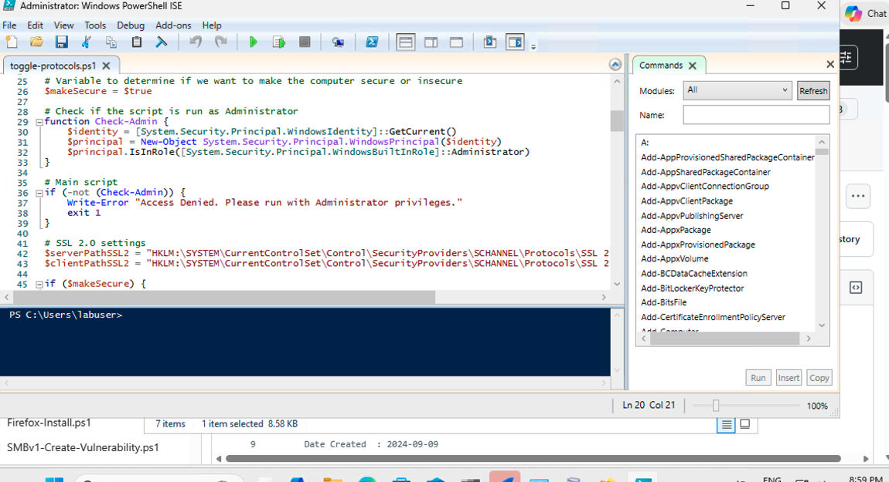
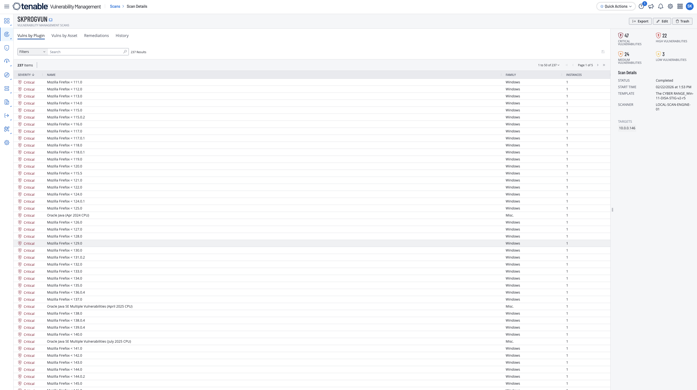
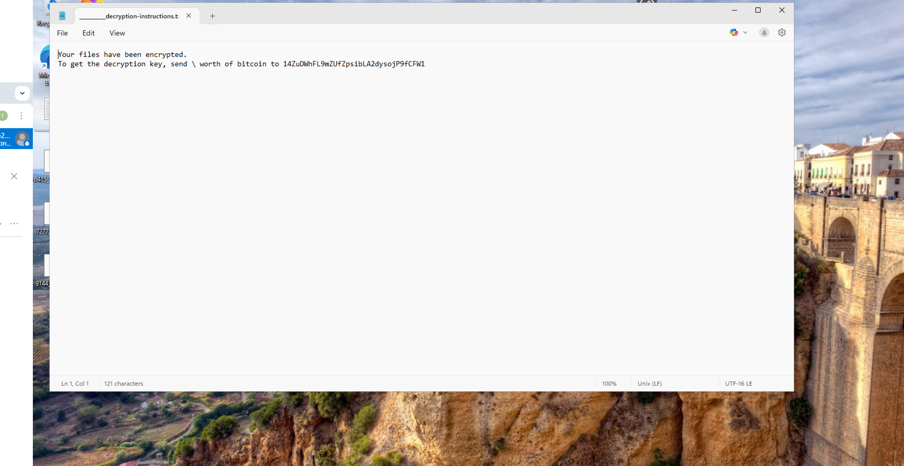

# Tenable Windows Lab: Programmatic Vulnerability Remediation

## Objective

Create and detect Windows vulnerabilities with authenticated Tenable scanning, then remediate them programmatically with PowerShell scripts and validate the results with rescans.

## Environment

- Azure-hosted Windows 11 VM
- Tenable Vulnerability Management (authenticated scan)
- Windows 11 DISA/STIG-based template
- PowerShell remediation scripts (Firefox uninstall, SMBv1 remediation, TLS/protocol hardening)
- Azure Boot Diagnostics / Serial Console used for recovery troubleshooting

## Evidence

### Incomplete scan behavior (authenticated but not fully connecting)

### Scan history showing repeated partial connection attempts

### Running PowerShell helper script to improve scan connectivity

### Script execution/prerequisite issue requiring admin correction

### Azure Serial Console recovery path for VM access troubleshooting

### RDP recovery details after firewall/port issue

### Tenable scan showing full vulnerability detection after fixes

### Ransomware incident evidence on exposed test VM

## What changed & why

This lab focused on automation-based remediation, but the main blocker was not remediation logic. It was scan connectivity. Authenticated scans were configured correctly, yet the scanner was not fully reaching the VM, so Tenable mostly showed SSL/TLS findings instead of the installed Windows vulnerabilities. After fixing reachability and host access issues (and using a PowerShell helper script to stabilize setup), the scan began returning the expected vulnerability set.

## Notable findings (examples)

- Authenticated scan status alone did not guarantee deep host visibility; incomplete connectivity still limited findings.
- The helper PowerShell workflow materially improved scan quality, changing results from partial/low findings to full vulnerability visibility.
- Firewall reset actions can break RDP access if port/rule restoration is not handled explicitly.
- Azure Serial Console and Boot Diagnostics provided a reliable recovery path when RDP/Bastion access failed.
- Once connectivity was restored, Tenable detected vulnerabilities such as insecure software, SMBv1, and discouraged SSL/TLS protocol configurations as expected.

## Incident and recovery note

A ransomware event occurred on the test VM during this work. The screenshot is preserved as lab evidence. This reinforces the need for strong credentials, controlled exposure time, and recovery readiness in cloud lab environments.

## Redaction note

Current screenshots and artifacts may include sensitive identifiers (for example IP addresses, hostnames, usernames, scanner names, tenant details, or registry/service values). Redact or blur sensitive fields before public publishing.

## Source brief

- Lab notes: `source/lab-brief.docx`
- Additional notes: `source/lab-notes.md`
