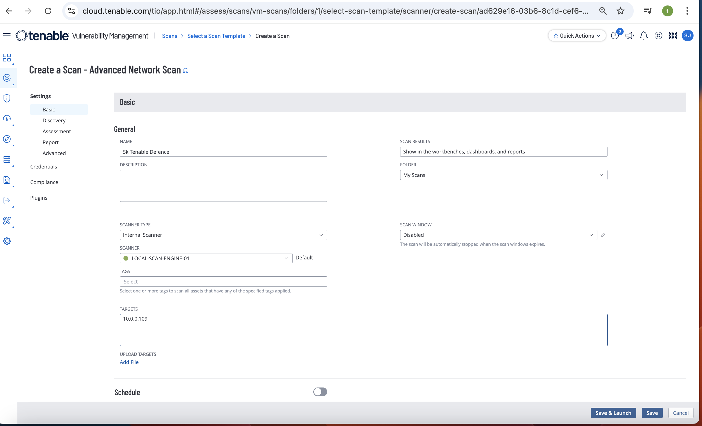
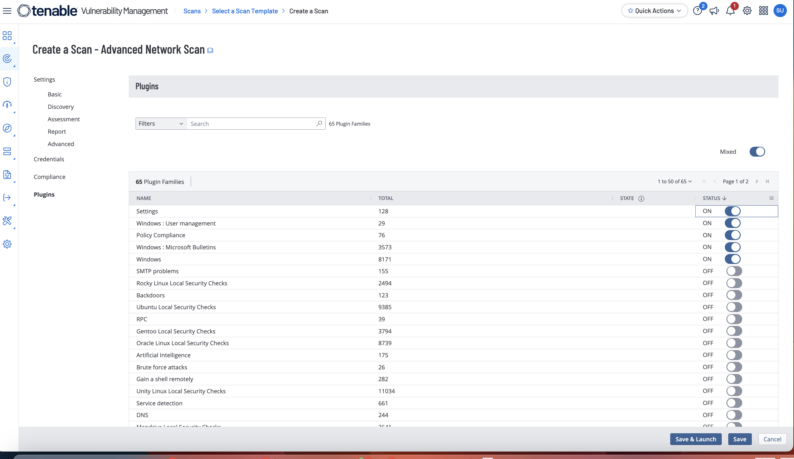
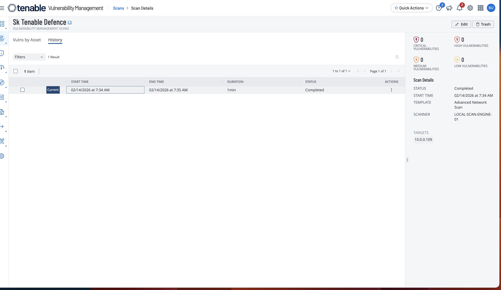
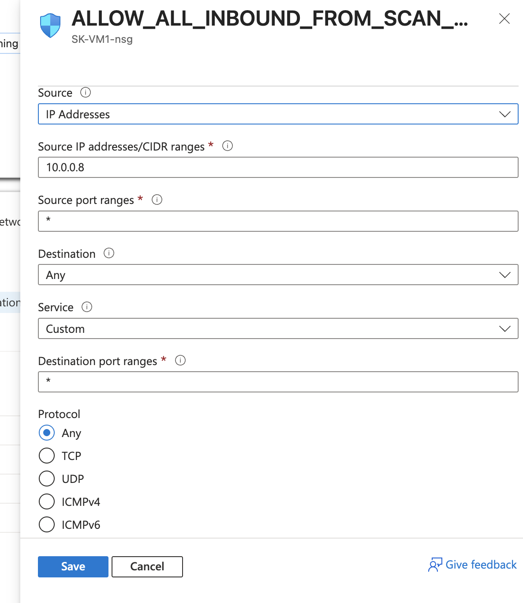
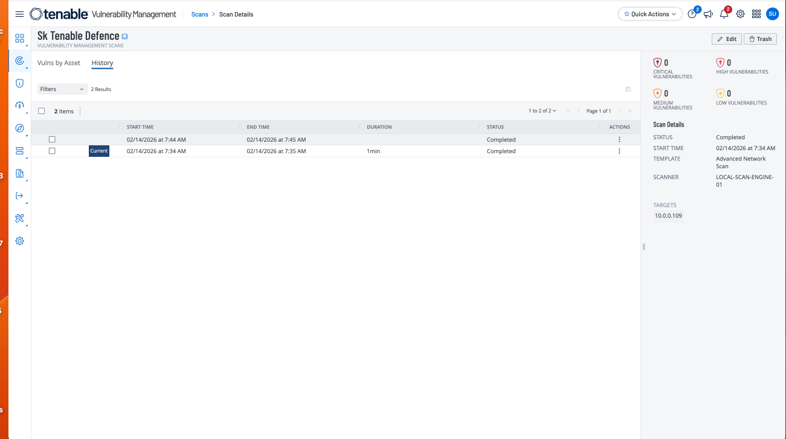
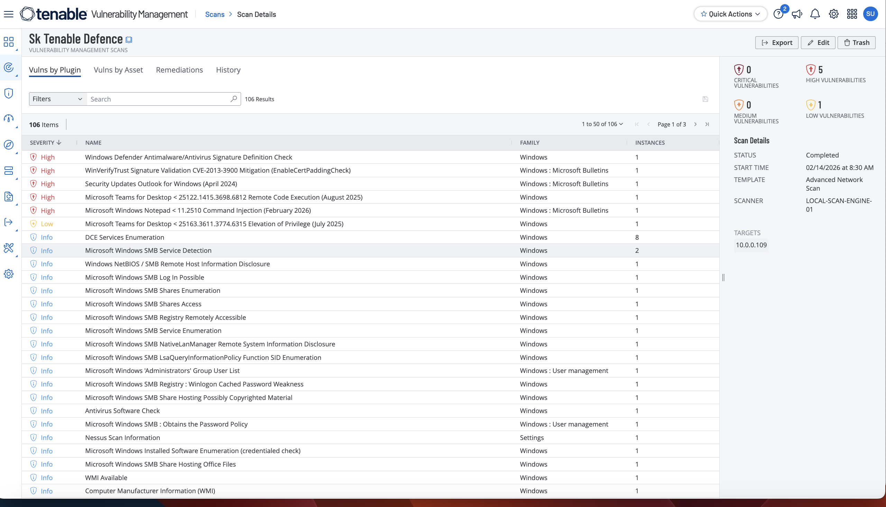

# Tenable Windows Lab: Troubleshooting and Deeply Understanding Scans

## Objective

Troubleshoot why Tenable scans were returning minimal results, then validate the exact network, host, and credentialed prerequisites required for reliable Windows vulnerability and compliance scanning.

## Environment

- Azure-hosted Windows VM with custom NSG
- Tenable Vulnerability Management (Advanced Network Scan)
- Windows-focused plugin scope (Policy Compliance, Settings, Windows)
- Troubleshooting across NSG rules, Windows Firewall, and remote-audit permissions

## Evidence

### Initial advanced scan creation

### Policy/plugin scope selection

### First scan result (no findings due to reachability constraints)

### NSG inbound allow rule creation

### Second scan result (still blocked at host layer)

### PowerShell remediations for connectivity and remote audits

### Final connected scan result with findings

## What changed & why

This lab showed layered scan dependencies. Opening NSG traffic alone was not sufficient; Windows firewall behavior and remote-audit prerequisites still prevented meaningful checks. Enabling required inbound rules/protocols (ICMP, SMB, WMI), fixing token-filter/remote-registry constraints, and adjusting Tenable host discovery behavior produced stable scan execution and richer findings.

## Notable findings (examples)

- Early scan runs completed but produced little/no actionable output when network or host controls blocked scanner access.
- After host-level remediation, Tenable returned vulnerability and policy/compliance-relevant results.
- Troubleshooting proved that scan quality depends on end-to-end reachability plus Windows remote-management permissions, not only scanner policy selection.

## Redaction note

Current screenshots may contain sensitive identifiers (for example IP addresses, hostnames, account names, tenant details, or scanner metadata). Before publishing publicly, crop or blur sensitive fields and redact identifiers.

## Source notes

- Lab notes: `source/lab-notes.md`
