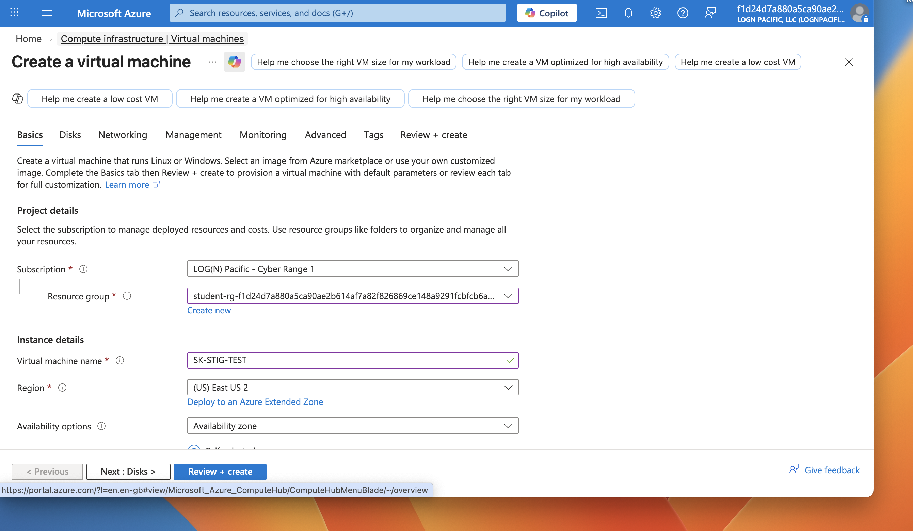
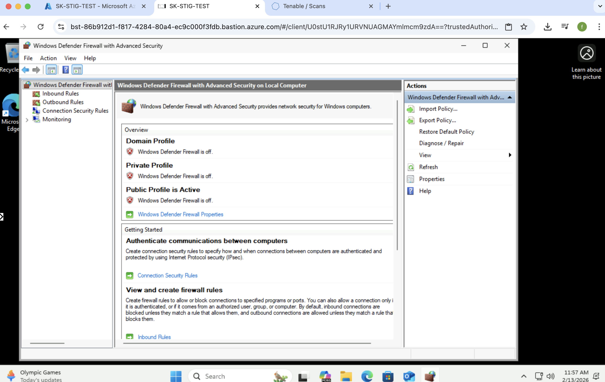
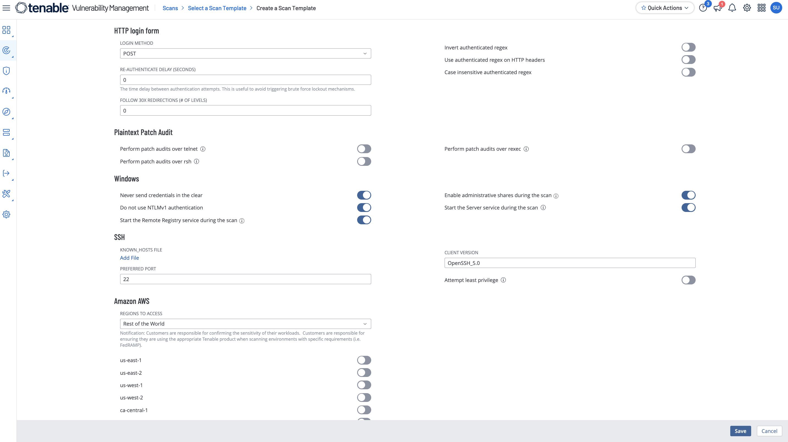
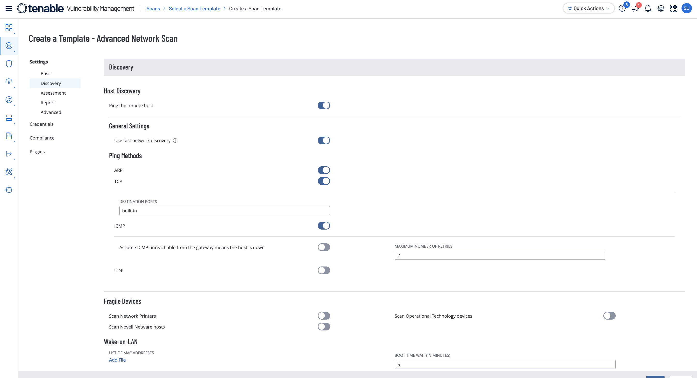
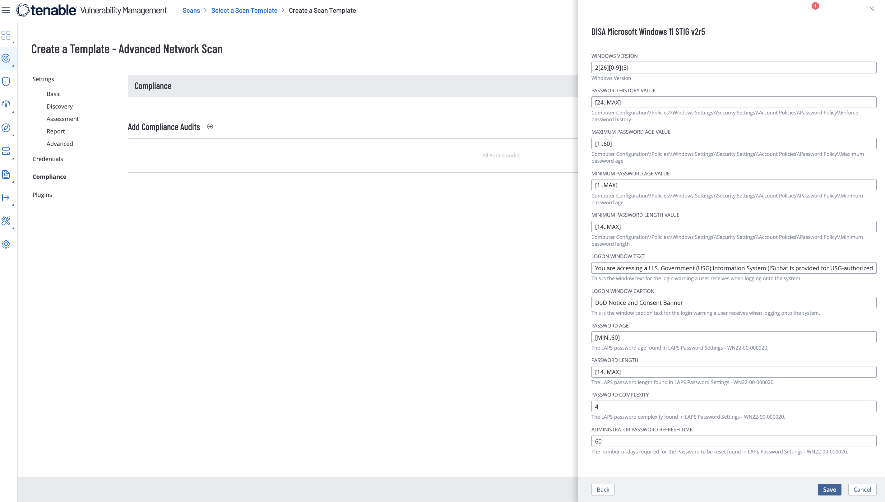
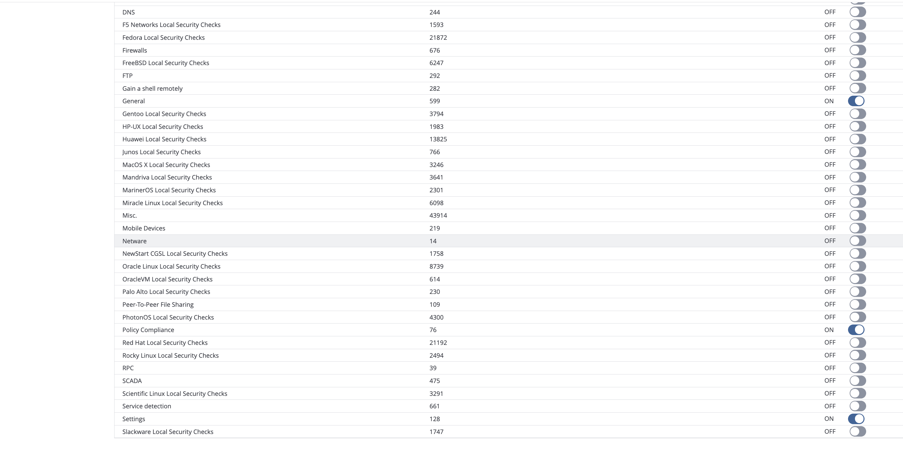
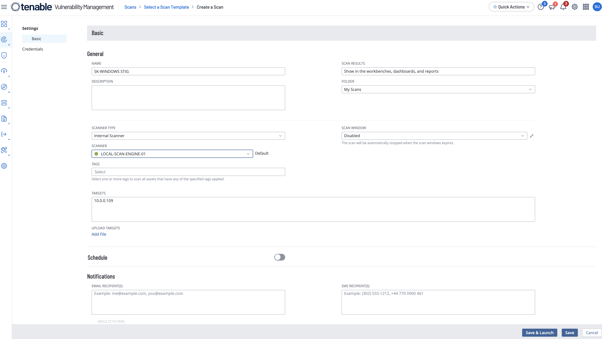
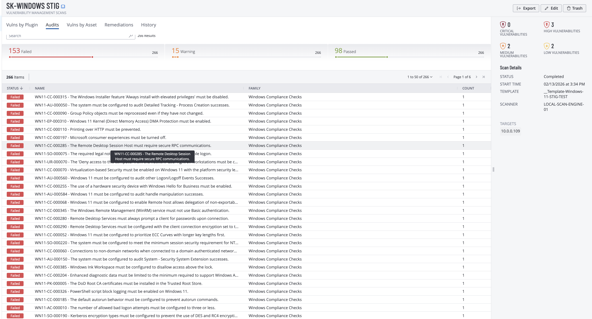

# Tenable Windows 11 Lab: Scan Template + STIG Compliance

## Objective

Build and use a reusable Tenable scan template for a Windows 11 VM, then run a credentialed scan with STIG compliance checks to validate vulnerability and audit coverage.

## Environment

- Cloud-hosted Windows 11 VM (Azure)
- Tenable Vulnerability Management
- Advanced Network Scan template
- Windows credentialed scanning (administrator account)
- Compliance audit profile for DISA Microsoft Windows 11 STIG

## Evidence

### Windows 11 VM creation in Azure

### Firewall/host preparation for lab connectivity

### Template basic configuration

### Scan template selection in Tenable

### Discovery settings (TCP + fast discovery)

### Assessment settings

### Compliance audit selection (Windows 11 STIG)

### Plugin scope selection

### Final scan setup from template

### Compliance audit results with failures

## What changed & why

Compared with a standard vulnerability-only run, this workflow adds a reusable template plus compliance auditing. Credentialed checks allow deeper host inspection, and STIG policy audits validate security-control posture rather than only service-exposed vulnerabilities.

## Notable findings (examples)

Tenable compliance output shows failed STIG controls, demonstrating that the policy audit executed successfully and produced control-level remediation targets. The scan configuration evidence also confirms deliberate scope choices for discovery, assessment depth, compliance checks, and plugin categories.

## Redaction note

Current screenshots and artifacts may include sensitive identifiers (for example internal/public IP addresses, hostnames, usernames, scanner names, or tenant details). Before publishing publicly, crop or blur sensitive fields and redact identifiers.

## Source brief

- Lab notes: `source/lab-brief.docx`
