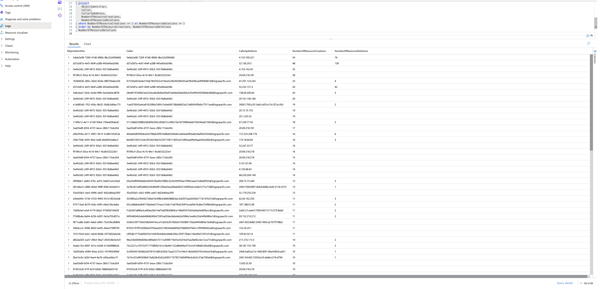
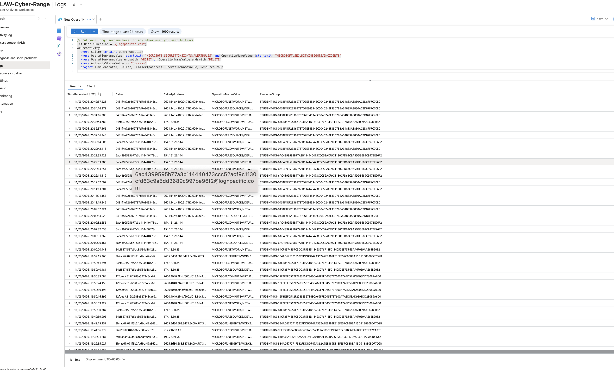
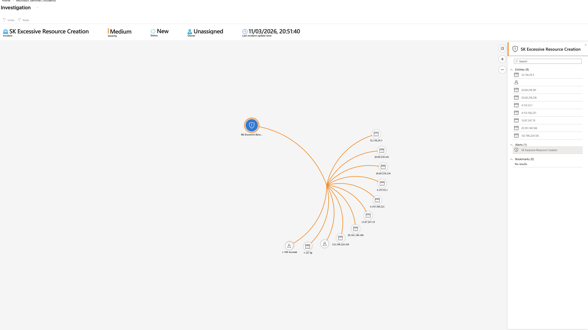

# Threat Hunting Lab: Excessive Azure Resource Creation or Deletion

## Objective

Detect and investigate unusually high volumes of Azure resource write/delete operations by a single caller, then determine whether activity is malicious, misconfigured automation, or expected operational behavior.

## Environment

- Microsoft Sentinel + Azure Log Analytics
- Primary telemetry source: `AzureActivity`
- Detection scope: successful `WRITE` and `DELETE` operations
- Exclusions: Sentinel incident/rule management operations

## Detection logic (core)

- Parse caller/object identity from `Claims`
- Count successful resource creations/deletions per caller + identity + IP
- Trigger threshold: 5 or more successful writes/deletes
- Rule intent: detect potential abuse, runaway automation, or unauthorized cloud operations

## Evidence

### AzureActivity detection query output

### Incident entity overview and triage context

### Caller/IP and operation-level review

## Observations

- Multiple caller identities and source IPs exceeded the configured operation threshold.
- High-frequency write/delete actions were observed for virtual machine and related resource operations.
- Entity/context review was required to separate lab behavior from potentially abusive behavior.

## Assessment

Within this investigation context, the alert was assessed as a **false positive** tied to legitimate lab provisioning and deletion activity, not unauthorized destructive behavior.

## Response summary (NIST-aligned)

- Preparation: detection rule and entity mapping were configured.
- Detection/Analysis: high-volume operations were identified and reviewed per caller.
- Containment: no containment required after legitimacy validation.
- Eradication/Recovery: no malicious artifacts or compromise indicators identified.
- Post-Incident: recommendation to tune thresholds and governance controls.
- Closure: incident documented and closed as false positive.

## Improvement notes

- Tune thresholds by role/workload profile to reduce expected lab/ops noise.
- Apply Azure Policy/governance controls for resource provisioning patterns.
- Add allow-lists for known automation identities where appropriate.
- Retain high-confidence alerting for unknown callers or unusual IP/caller combinations.

## Redaction note

Current screenshots and artifacts may include sensitive identifiers (for example caller IDs, IP addresses, tenant/resource details, and subscription metadata). Redact or blur sensitive fields before public publishing.

## Source briefs

- Scenario lab sheet: `source/lab-brief.docx`
- Analyst notes: `source/analyst-notes.docx`
- Analyst notes (extended): `source/analyst-notes-extended.docx`
- Analyst notes (duplicate snapshot): `source/analyst-notes-duplicate.docx`
