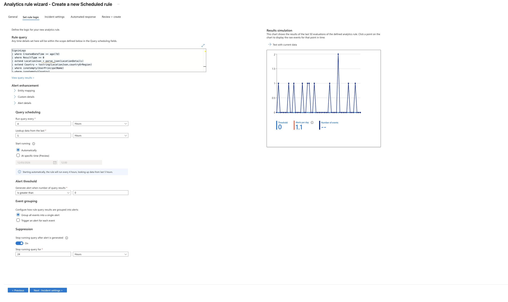
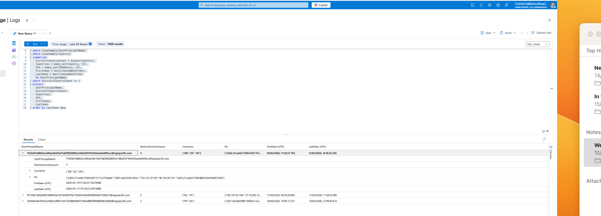
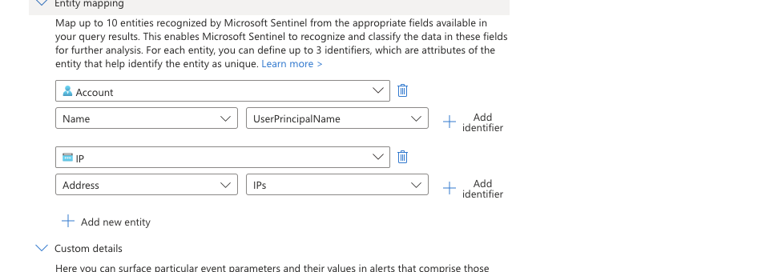
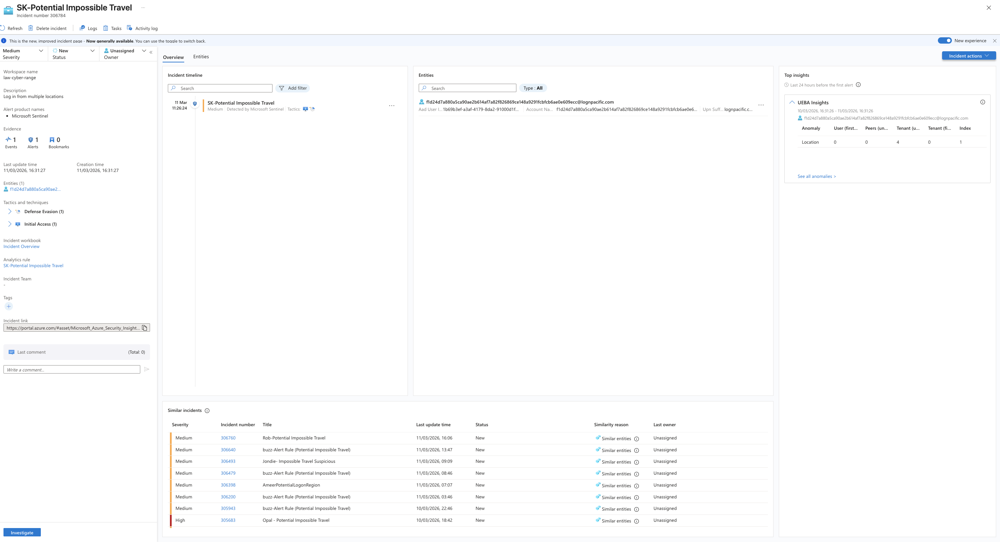

# Threat Hunting Lab: Potential Impossible Travel

## Objective

Detect and investigate suspicious authentication patterns where a single account appears to authenticate from multiple countries in implausible time windows.

## Environment

- Azure / Entra ID sign-in telemetry
- Microsoft Sentinel + Log Analytics workspace
- Primary telemetry source: `SigninLogs`
- Detection model: multiple successful sign-ins from different countries within 7 days

## Detection logic (core)

- Start with successful sign-ins only (`ResultType == 0`)
- Parse `LocationDetails` for country values
- Count distinct countries per `UserPrincipalName`
- Trigger when `DistinctCountryCount >= 2`

## Evidence

### Rule query and threshold tuning workflow

### Incident assignment and triage workflow

### User-to-country correlation output from hunt query

### Response actions and closure state

## Observations

- Multiple user accounts were flagged with sign-in activity across two or more countries in short windows.
- Example patterns included combinations such as `NL -> JP` and `FR -> US` within timeframes unlikely for legitimate travel.
- Source IP variation and rapid geographic switching increased suspicion.

## Assessment

The observed sign-in patterns are consistent with either credential misuse/compromise or login obfuscation via VPN/proxy infrastructure. In this lab context, the cases were treated as true-positive suspicious behavior requiring containment-style response steps.

## Response summary (NIST-aligned)

- Preparation: detection rule and role ownership were defined.
- Detection/Analysis: suspicious country-based sign-in patterns were validated via KQL.
- Containment: account lockdown/disablement and user verification were defined as primary controls.
- Eradication/Recovery: credential reset and continued monitoring were applied/recommended.
- Post-Incident: policy improvements documented (geo-based controls, stronger auth controls).
- Closure: incident documented and formally closed.

## Improvement notes

- Implement Conditional Access geo-fencing where operationally viable.
- Enforce MFA and risk-based sign-in controls for externally accessible accounts.
- Add playbook automation for impossible-travel triage and account response steps.

## Redaction note

Current screenshots and artifacts may include sensitive identifiers (for example user principal names, IP addresses, tenant details, and incident data). Redact or blur sensitive fields before public publishing.

## Source briefs

- Scenario lab sheet: `source/lab-brief.docx`
- Analyst notes: `source/analyst-notes.docx`
- Analyst report: `source/analyst-report.docx`
