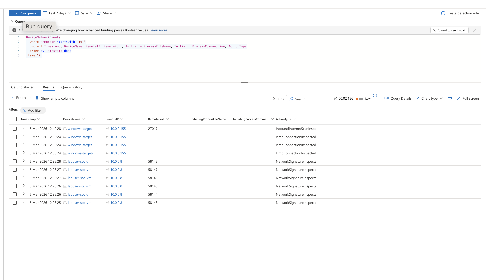
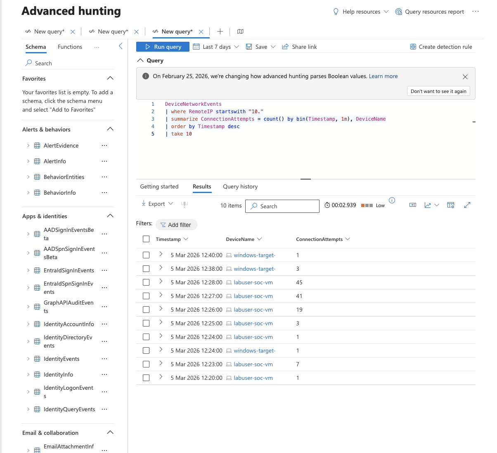
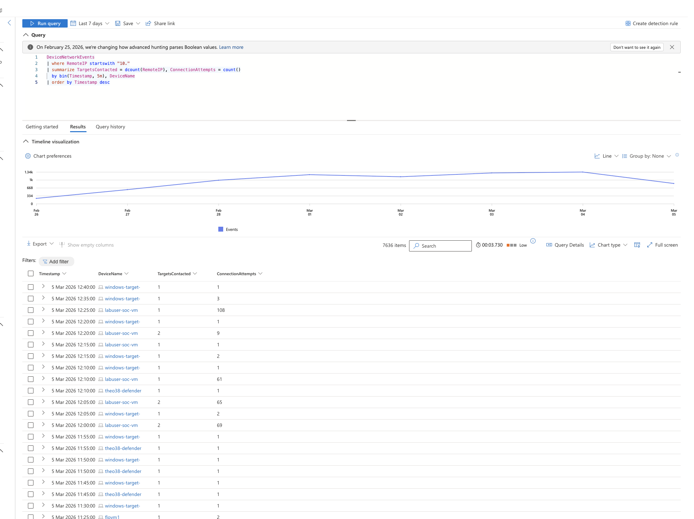
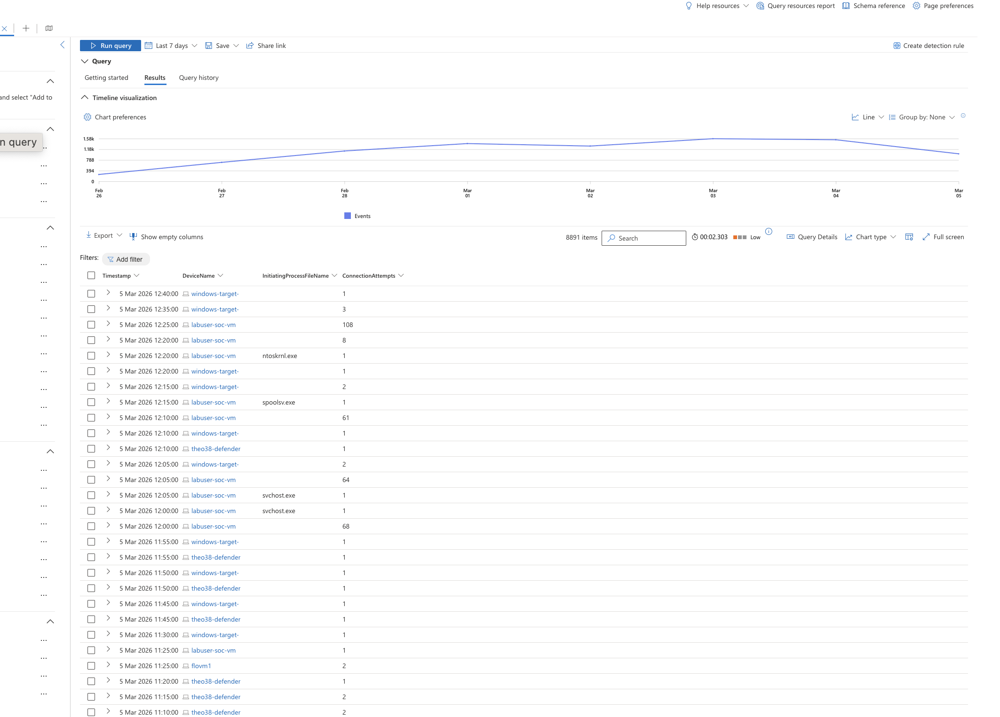

# Threat Hunting Lab: Scenario 2 - Sudden Network Slowdowns

## Objective

Investigate internal network slowdowns by hunting for suspicious connection patterns and endpoint activity using Microsoft Defender / Sentinel telemetry and KQL.

## Environment

- Azure-hosted Windows VM onboarded to MDE
- Microsoft Defender Advanced Hunting / Sentinel workflow context
- Log sources: `DeviceNetworkEvents`, `DeviceFileEvents`, `DeviceProcessEvents`
- Simulated suspicious activity via PowerShell-driven internal scanning behavior

## Hunt Hypothesis

Given internal network trust and unrestricted PowerShell usage, slowdowns may be caused by internal reconnaissance or excessive connection attempts (for example, port-scanning/lateral-movement style behavior) rather than external DDoS.

## Evidence

### Query 1: top failed connection sources

### Query 2: failed-connection count for IP in question

### Query 3: failed-connection event details over time

### Query 4: process pivot around suspicious timestamp window

## What changed & why

The hunt started at the network layer to identify connection anomalies, then pivoted to process-level evidence around the same time window. This cross-table approach reduces guesswork and ties network symptoms to probable host behavior.

## Notable findings (examples)

- Excessive failed internal connections from a specific host/IP were identified as the primary anomaly.
- Time-correlated pivots into `DeviceProcessEvents` provided context on what was executing during the spike window.
- The pattern is consistent with internal scanning/recon activity and explains the observed network degradation.
- This workflow demonstrates practical triage: network indicators first, endpoint/process correlation second, scoped response next.

## Response and improvement notes

- Short-term: isolate or constrain the offending host, investigate running scripts/process lineage, and verify no additional spread.
- Medium-term: limit unrestricted PowerShell use, tighten east-west traffic controls, and create detection rules for repeated failed-connection bursts.
- Process improvement: prebuild hunting playbooks that pair `DeviceNetworkEvents` anomalies with rapid process/file pivots.

## Redaction note

Current screenshots and artifacts may include sensitive identifiers (for example IP addresses, hostnames, usernames, tenant details, or query outputs). Redact or blur sensitive fields before public publishing.

## Source brief

- Lab notes: `source/lab-brief.docx`
