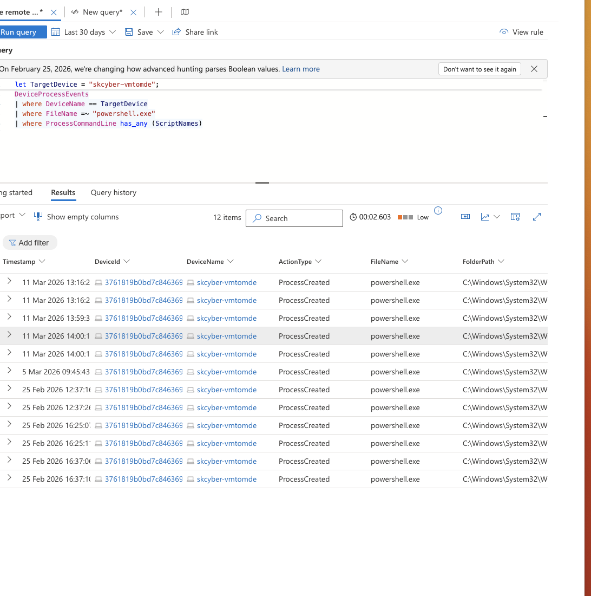
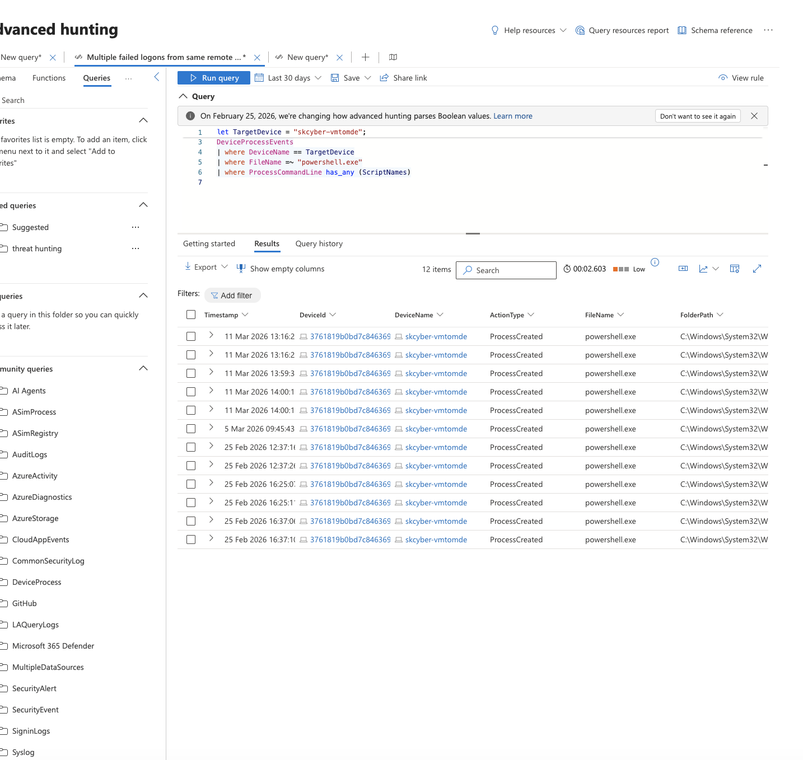
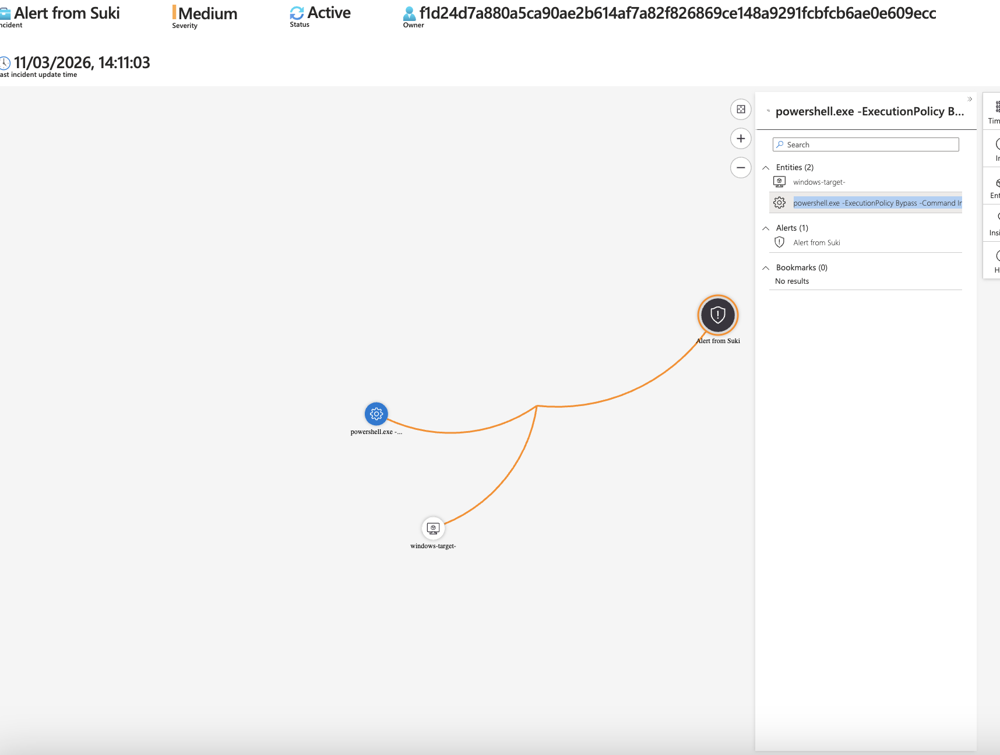
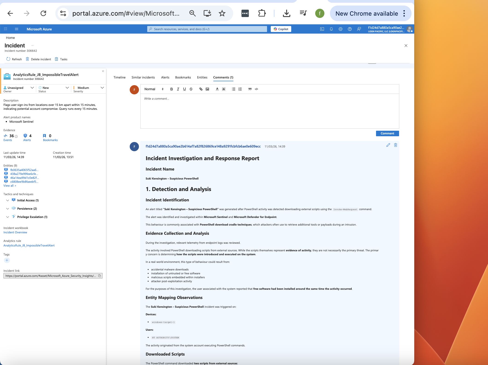
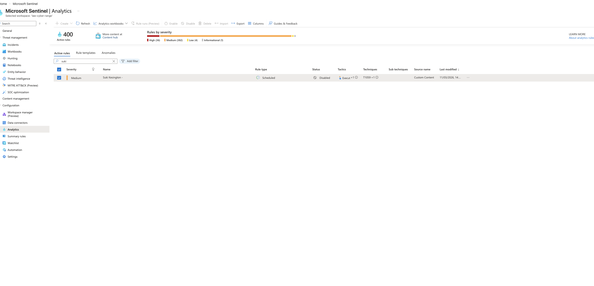

# Threat Hunting Lab: PowerShell Suspicious Web Request

## Objective

Detect and investigate suspicious PowerShell web-request behavior on a monitored endpoint, then complete incident handling through containment and closure workflows.

## Environment

- Azure-hosted Windows VM onboarded to MDE
- Microsoft Sentinel + Log Analytics workspace
- Primary telemetry source: `DeviceProcessEvents`
- Detection focus: PowerShell usage of `Invoke-WebRequest` for remote script download

## Detection logic (core)

- Filter `DeviceProcessEvents` for `powershell.exe`
- Match command lines containing `Invoke-WebRequest`
- Scope by target host where required
- Build Sentinel scheduled rule and auto-incident creation for operational workflow

## Evidence

### Detection query output for suspicious web-request behavior

### Incident overview and alert context

### Process command-line evidence of script download activity

### Entity mapping and timeline correlation view

### Response and closure workflow state

## Observations

- PowerShell command execution included `Invoke-WebRequest` with remote GitHub-hosted script retrieval.
- Command-line telemetry showed download-to-disk behavior (for example to `C:\ProgramData`) followed by script execution patterns.
- Incident workflow in Sentinel provided host/account/process entity context for analyst triage.

## Assessment

The observed behavior is consistent with suspicious script-delivery activity via legitimate tooling (PowerShell). In this scenario, telemetry supported investigation and response handling, including verification of what was downloaded and whether script execution occurred.

## Response summary (NIST-aligned)

- Preparation: detection and role workflows were already available.
- Detection/Analysis: suspicious `Invoke-WebRequest` activity was identified and investigated.
- Containment: endpoint isolation and anti-malware scan were considered/executed per workflow.
- Eradication/Recovery: script artifacts and execution context were reviewed for impact.
- Post-Incident: findings documented and policy improvements noted.
- Closure: incident closed as true positive within lab context.

## Improvement notes

- Improve alerting for PowerShell execution-policy bypass + remote download combinations.
- Add controls for script execution from high-risk locations such as `ProgramData`.
- Strengthen guardrails around unapproved software/script sources.

## Redaction note

Current screenshots and artifacts may include sensitive identifiers (for example hostnames, usernames, tenant details, and command-line values). Redact or blur sensitive fields before public publishing.

## Source briefs

- Scenario lab sheet: `source/lab-brief.docx`
- Analyst notes/report: `source/analyst-report.docx`
