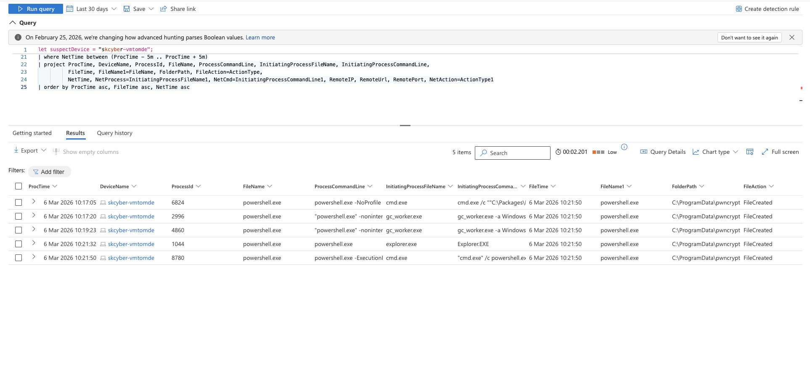
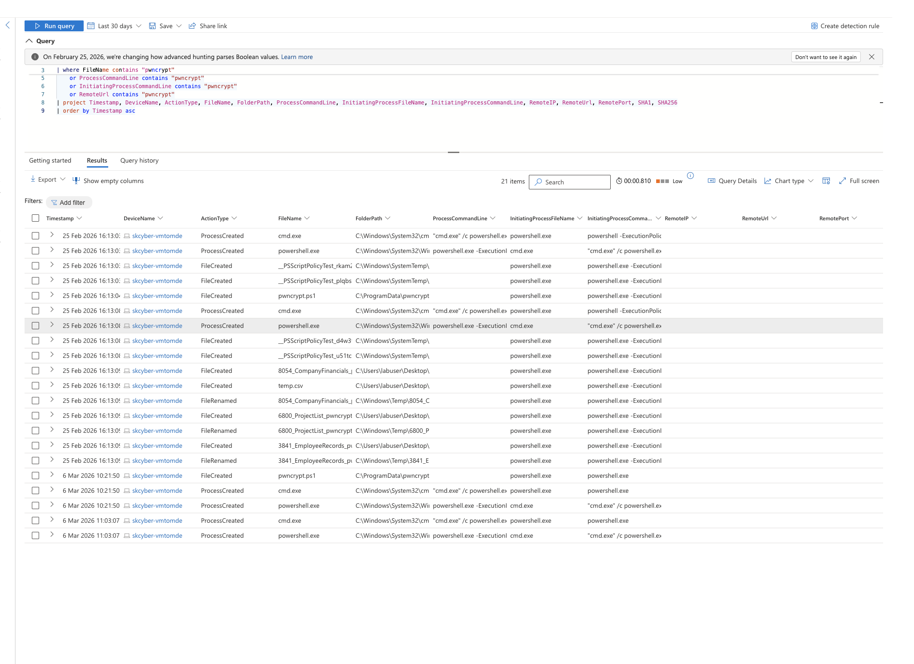
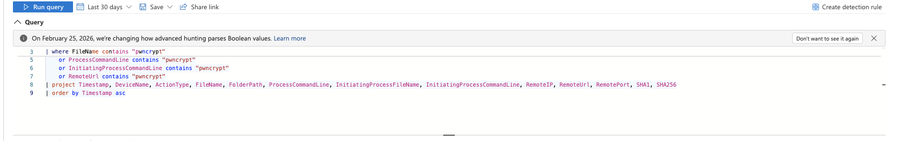
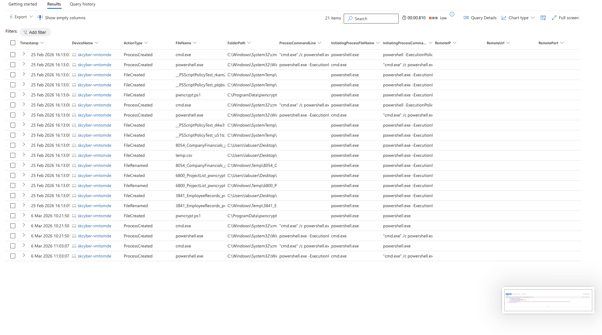

# Threat Hunting Lab: Scenario 4 - New Zero-Day Announced (PwnCrypt Ransomware)

## Objective

Investigate reported zero-day ransomware activity (PwnCrypt) by correlating endpoint file/process/network telemetry and determine whether ransomware execution occurred on the monitored host.

## Environment

- Azure-hosted Windows endpoint onboarded to MDE
- Microsoft Defender Advanced Hunting / Sentinel workflow context
- Log sources: `DeviceFileEvents`, `DeviceProcessEvents`, `DeviceNetworkEvents`
- Simulated payload execution via PowerShell-delivered `pwncrypt.ps1`

## Hunt Hypothesis

If PwnCrypt is active, we should observe:
- PowerShell-driven script execution with suspicious command-line patterns
- Payload staging in `C:\ProgramData\pwncrypt`
- File rename/modification behavior containing `.pwncrypt`
- Supporting process/network correlation in the same time window

## Evidence

### Initial IoC discovery query across process and file tables

### Process/file pivot around suspicious execution window

### Network telemetry summary for related process activity

### Correlated hunting output and analyst validation view

## What changed & why

The hunt progressed from simple indicator checks to telemetry correlation. Initial queries identified PwnCrypt-related artifacts, then pivots around suspicious timestamps linked process execution to file modifications and supporting network behavior. This confirmed ransomware-like behavior with stronger evidentiary confidence than any single table alone.

## Notable findings (examples)

- `pwncrypt.ps1` activity was observed in `C:\ProgramData\pwncrypt`, consistent with payload staging.
- PowerShell execution was launched via `cmd.exe` with command-line characteristics associated with scripted execution.
- File activity included `.pwncrypt`-style rename behavior aligned with ransomware encryption routines.
- Multiple PowerShell executions occurred in short intervals, indicating automation/repetition.
- Network telemetry provided additional context for suspicious process behavior during the same period.

## Analyst conclusion

Based on correlated process + file evidence, ransomware execution behavior was observed on the investigated host. The findings are consistent with PwnCrypt-style script-driven encryption activity.

## Response and improvement notes

- Immediate response: isolate the endpoint, terminate malicious processes, remove staged payload artifacts, and begin recovery workflow.
- Recovery posture: rely on verified backups for data restoration where encryption occurred.
- Detection improvements: alert on PowerShell script execution from unusual paths (`ProgramData`), execution-policy bypass patterns, and high-rate rename/extension-change events.
- Containment maturity: automate endpoint isolation for high-confidence ransomware indicators.

## Redaction note

Current screenshots and artifacts may include sensitive identifiers (for example hostnames, usernames, tenant details, device names, and query values). Redact or blur sensitive fields before public publishing.

## Source brief

- Lab notes and analyst report: `source/lab-brief.docx`
