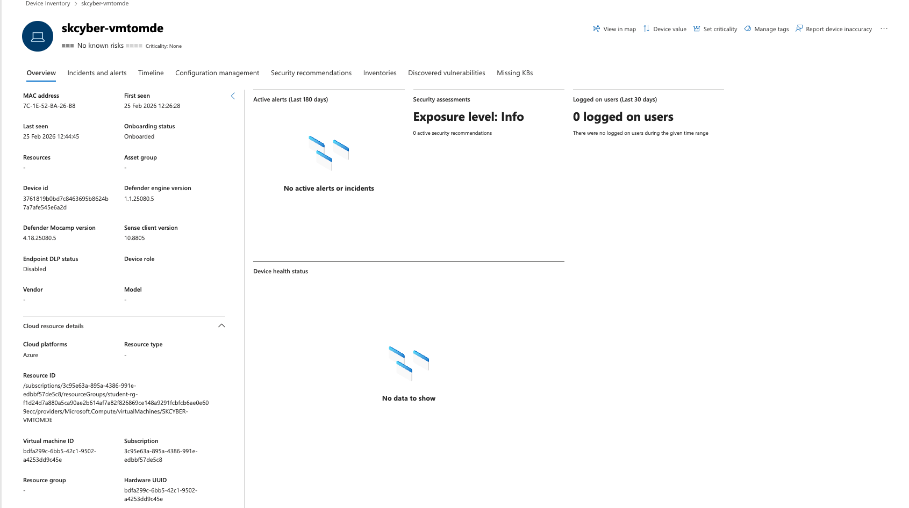
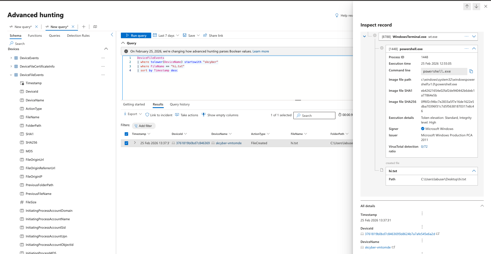
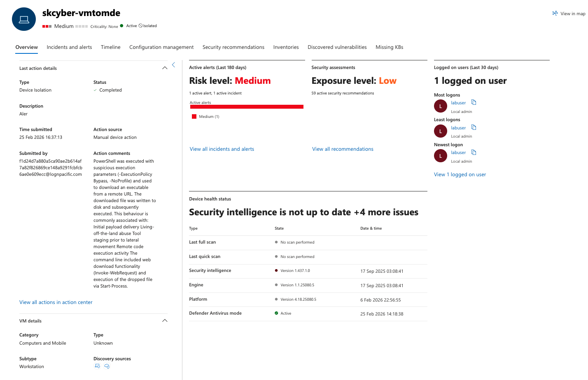
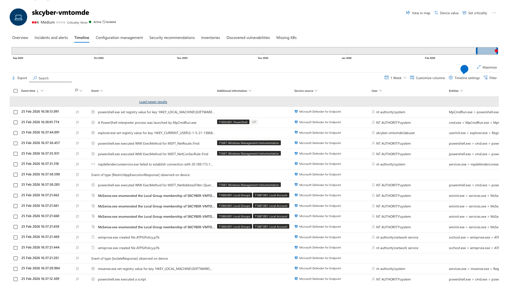
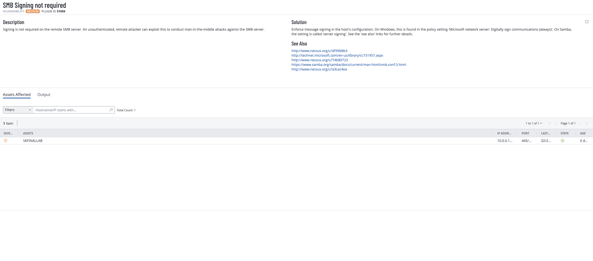

# Threat Hunting Lab: Microsoft Sentinel / MDE Remote Code Execution Detection and Isolation

## Objective

Create and validate a detection workflow for suspicious PowerShell-based remote code execution behavior, then confirm automated response actions (device isolation and investigation package collection) in Microsoft Defender / Sentinel-linked monitoring.

## Environment

- Azure-hosted Windows VM
- Microsoft Defender for Endpoint (MDE) onboarding and device telemetry
- KQL-based hunting/detection logic (Defender Advanced Hunting / Sentinel workflow context)
- Azure Log Analytics / security telemetry pipeline (lab context)
- Automated response actions: isolate device + collect investigation package

## Evidence

### Device onboarding and deployment verification (MDE)

### KQL query work to characterize PowerShell behavior

### Incident triggered and visible in security dashboard

### Timeline of execution and detection events

### Additional alert/investigation evidence

## What changed & why

This lab moved from basic telemetry validation to active detection engineering. Instead of only reviewing logs, the workflow used KQL to identify PowerShell behavior consistent with staged download-and-execute activity (for example, `Invoke-WebRequest` + `Start-Process`) and then automated response actions to contain the VM. The value of the lab is in proving both detection logic and response execution.

## Notable findings (examples)

- MDE onboarding and device deployment status must be correct before hunting queries and detections produce reliable results.
- KQL tuning was required to characterize the PowerShell execution pattern and scope the rule to the intended VM.
- Detection rules should be device-specific in shared environments to avoid isolating the wrong host.
- Automated response (device isolation + investigation package collection) provided immediate containment and useful forensic artifacts.
- Timeline evidence helps validate end-to-end sequencing from execution to alert to response.

## Redaction note

Current screenshots and artifacts may include sensitive identifiers (for example tenant names, device names, usernames, incident IDs, IP addresses, subscription details, or query values). Redact or blur sensitive fields before public publishing.

## Source brief

- Lab notes: `source/lab-brief.docx`
