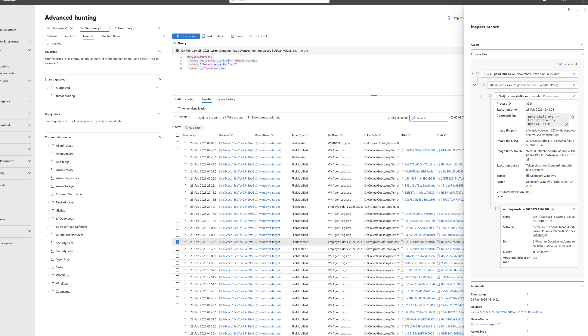
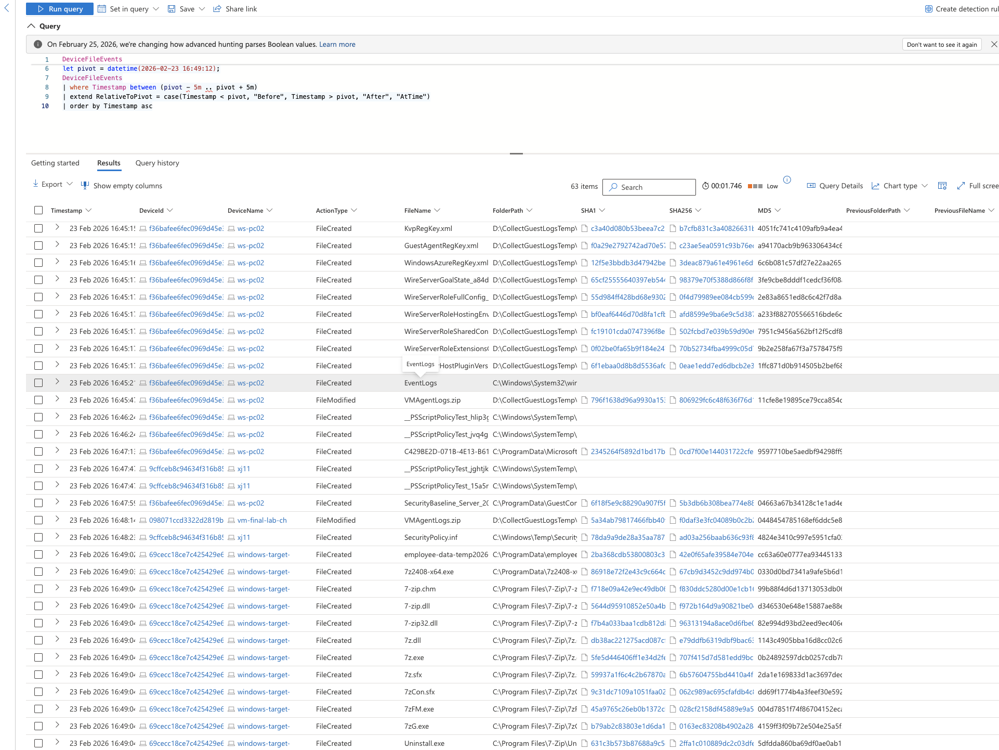
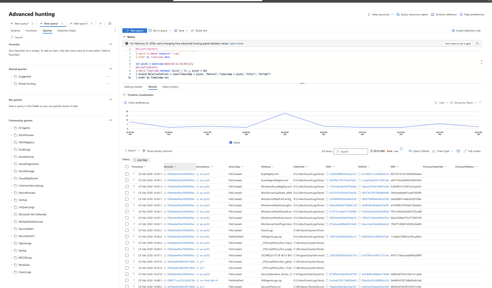
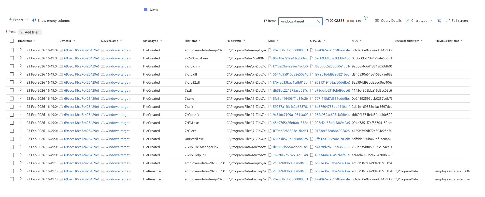

# Threat Hunting Lab: Scenario 3 - Suspected Data Exfiltration from PIPd Employee

## Objective

Investigate potential insider-driven data exfiltration by correlating process, file, and network telemetry in Microsoft Defender / Sentinel-linked hunting workflows.

## Environment

- Azure-hosted Windows VM onboarded to MDE
- Microsoft Defender Advanced Hunting / Sentinel workflow context
- Log sources: `DeviceProcessEvents`, `DeviceFileEvents`, `DeviceNetworkEvents`
- Simulated suspicious behavior via PowerShell script execution and data archiving activity

## Hunt Hypothesis

A user on `windows-target-` may be staging proprietary data for exfiltration by using archive tools and PowerShell automation. The hunt goal is to determine whether staging or confirmed exfiltration occurred.

## Evidence

### Suspicious file event activity

### File modification and archive-related timeline

### Process/command evidence around archive behavior

### Network correlation checks around the suspicious window

## What changed & why

The investigation started with suspicious event hunting and moved into timestamp-based pivots across process, file, and network telemetry. This method confirmed data packaging/staging behavior and reduced false assumptions by requiring cross-table correlation before declaring exfiltration.

## Notable findings (examples)

- PowerShell-driven activity and archive utility usage (including 7-Zip install/use) were observed around suspicious timestamps.
- Employee data was compressed and renamed, which is consistent with staging behavior.
- Internal suspicious connection/login patterns were observed and used as pivot anchors.
- No endpoint telemetry conclusively proved outbound exfiltration during the reviewed period.

## Analyst conclusion

Evidence strongly supports **collection and staging** activity, but **does not yet confirm successful exfiltration** from available endpoint logs.

## MITRE ATT&CK mapping (from findings)

- `T1046` - Network Service Scanning
- `T1110` - Brute Force
- `T1059.001` - PowerShell
- `T1560.001` - Archive via Utility
- `T1074` - Data Staged

## Response and improvement notes

- Escalated findings to management/security stakeholders with evidence timeline and analyst assessment.
- Recommended containment/controls: endpoint isolation during investigation, tighter PowerShell controls/logging, archive-creation monitoring, unusual-authentication detection, and DLP guardrails on sensitive data.
- Investigation remains open pending additional corroborating telemetry.

## Redaction note

Current screenshots and artifacts may include sensitive identifiers (for example usernames, hostnames, tenant details, incident metadata, and query values). Redact or blur sensitive fields before public publishing.

## Source brief

- Lab notes and analyst write-up: `source/lab-brief.docx`
