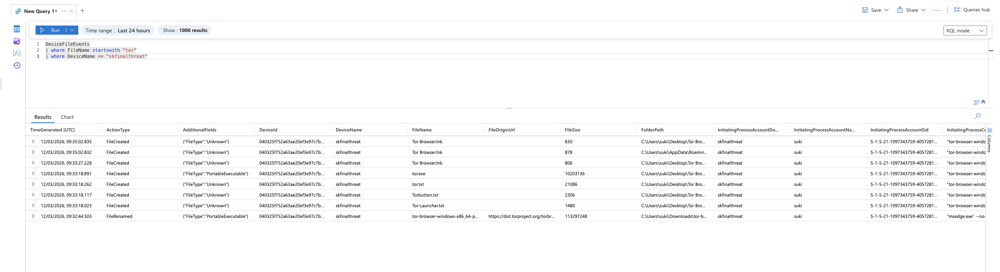
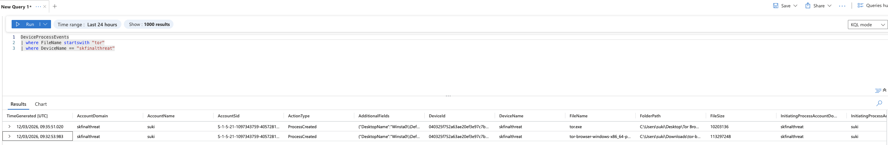
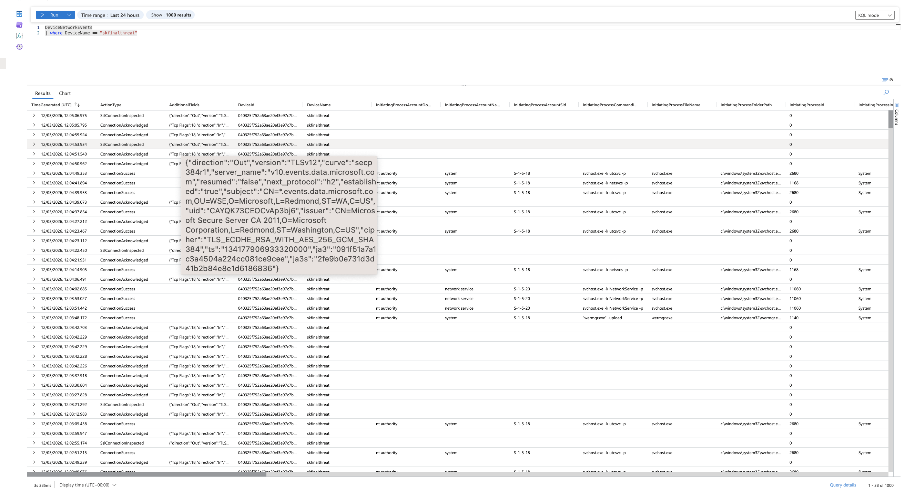

# Threat Hunting Lab: Unauthorized TOR Usage

## Objective

Detect unauthorized TOR browser installation and usage on an endpoint by correlating file, process, and network telemetry in Microsoft Defender/Sentinel.

## Environment

- Microsoft Defender for Endpoint + Microsoft Sentinel
- Endpoint under investigation: `skfinalthreat`
- Data sources: `DeviceFileEvents`, `DeviceProcessEvents`, `DeviceNetworkEvents`

## Detection strategy

- File telemetry: TOR artifacts and installer traces.
- Process telemetry: `tor.exe` and associated launch activity.
- Network telemetry: outbound traffic patterns consistent with TOR usage.

## Evidence

### File artifact query results

### Process execution evidence

### Network activity evidence

## Observations

- TOR-related binaries/artifacts were observed on disk.
- Process telemetry showed execution of TOR-related components under user context.
- Network telemetry showed encrypted outbound communication patterns aligned with TOR activity.

## Assessment

Cross-source telemetry supports confirmed unauthorized TOR usage on the endpoint within this lab scenario. Behavior indicates policy bypass risk and reduced network visibility if left unchecked.

## Response summary (NIST-aligned)

- Detection/Analysis: TOR indicators confirmed across file/process/network data.
- Containment: device isolation recommended/performed for investigation control.
- Eradication: TOR artifacts scheduled for removal and user context reviewed.
- Recovery: restore endpoint to compliant state and monitor for recurrence.
- Lessons learned: maintain targeted detections for TOR artifact creation, TOR process execution, and associated network signatures.

## MITRE ATT&CK mapping (from report)

- `T1090` - Proxy
- `T1071.001` - Application Layer Protocol: Web Protocols
- `T1105` - Ingress Tool Transfer
- `T1036` - Masquerading

## Redaction note

Any screenshots or exported logs for this lab may contain sensitive identifiers (hostnames, usernames, IPs, tenant details, URLs, or account IDs). Redact before publishing publicly.

## Source briefs

- Threat event brief: `source/lab-brief.md`
- Hunt template: `source/hunt-template.docx`
- Lab notes: `source/lab-notes.docx`
- Analyst report: `source/analyst-report.docx`
