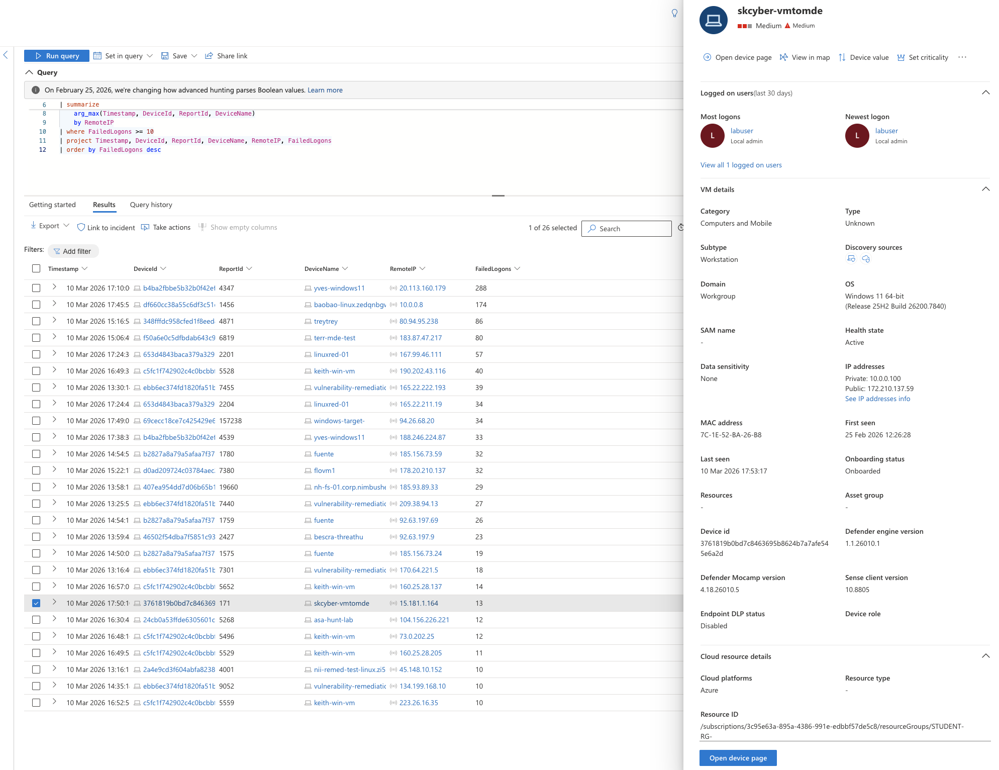
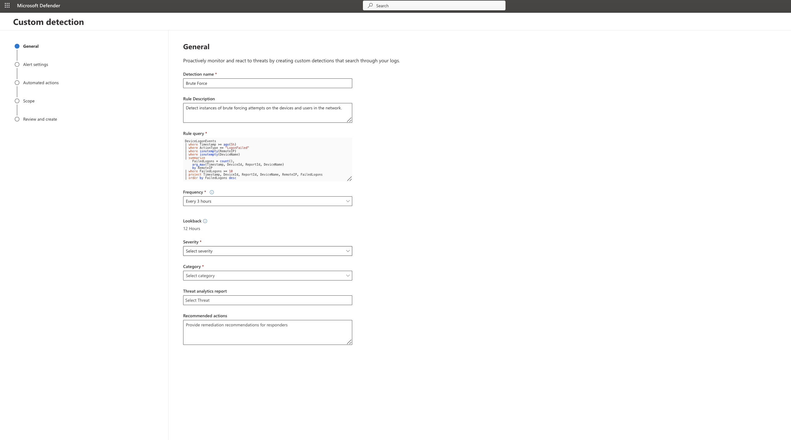
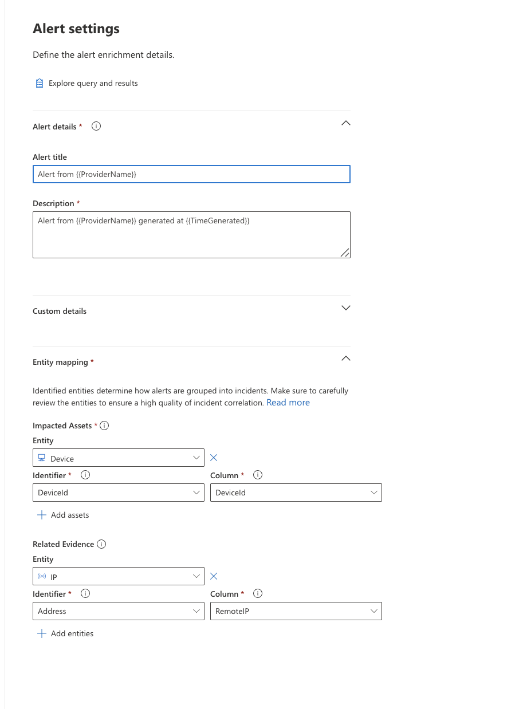
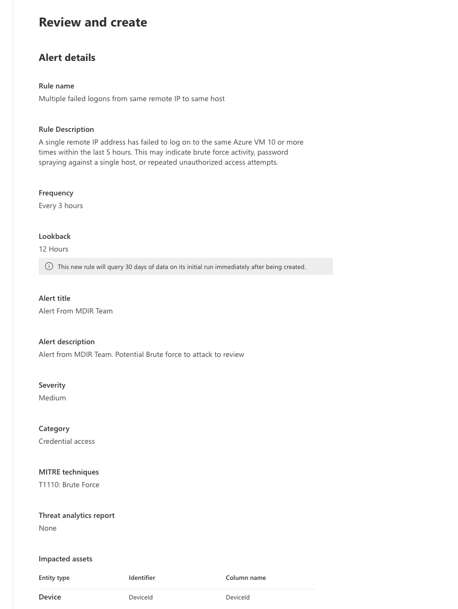
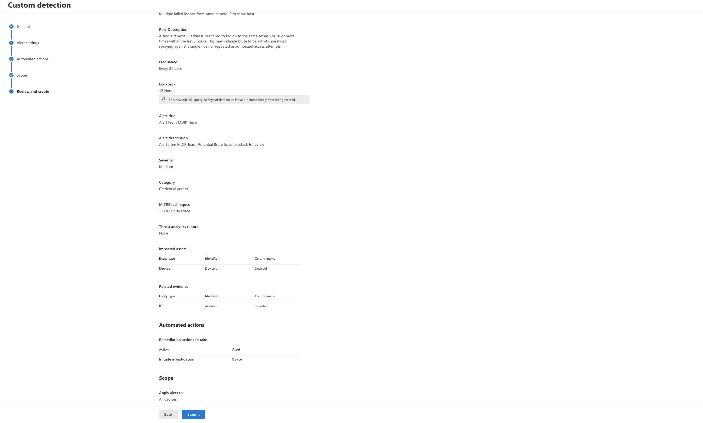
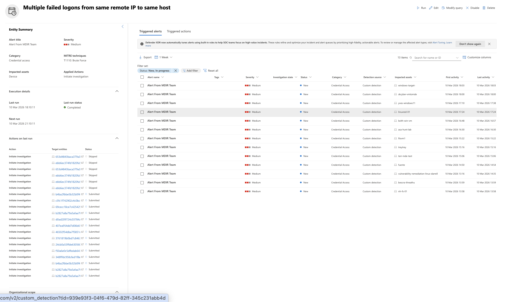

# Threat Hunting Lab: Scenario 1 - Virtual Machine Brute Forcing

## Objective

Detect, investigate, and close a brute-force authentication incident against Azure virtual machines using Microsoft Sentinel / MDE telemetry and an incident-response workflow aligned with NIST 800-61.

## Environment

- Azure-hosted Windows VMs onboarded to MDE
- Microsoft Sentinel + Log Analytics workspace
- Primary telemetry source: `DeviceLogonEvents`
- Scheduled Analytics Rule for repeated failed logons from same remote IP to same host

## Detection logic (core)

- Query logic: `LogonFailed` events over 5 hours
- Aggregation: `RemoteIP` + `DeviceName`
- Trigger threshold: `EventCount >= 10`
- Incident behavior: auto-create incident and group alerts (24-hour window)

## Evidence

### Brute-force attempt overview across targeted systems

### Detection query results in Sentinel context

### Incident investigation workflow view

### Entity mapping and authentication analysis

### Containment action: NSG hardening / access restriction

### Incident closure and documentation state

## What changed & why

This lab converted raw failed-authentication telemetry into an actionable incident workflow. Rather than only detecting failed logons, the process validated whether brute force attempts resulted in successful access, then implemented containment controls to reduce future exposure.

## Notable findings (examples)

- Multiple failed logon attempts from external IPs targeted exposed VM management paths.
- Entity mapping linked attempts across more than one host, improving scope awareness.
- Investigation did not confirm successful brute-force authentication on the affected hosts.
- NSG hardening reduced external RDP exposure and lowered repeat attack surface.

## Incident response summary (NIST-aligned)

- Preparation: monitoring, role assignment, and rule setup were in place.
- Detection/Analysis: alert triage confirmed repeated failed logon behavior.
- Containment: NSG restricted remote access to trusted sources.
- Eradication: no attacker foothold identified; no malicious artifacts requiring removal.
- Recovery: host verification and AV checks showed normal operation.
- Post-Incident: documented lessons learned and proposed policy hardening.
- Closure: incident finalized as true positive brute-force attempt, no confirmed compromise.

## Redaction note

Current screenshots and artifacts may include sensitive identifiers (for example source IPs, hostnames, usernames, incident IDs, and tenant details). Redact or blur sensitive fields before public publishing.

## Source briefs

- Scenario lab sheet: `source/lab-brief.docx`
- Analyst report: `source/analyst-report.docx`
